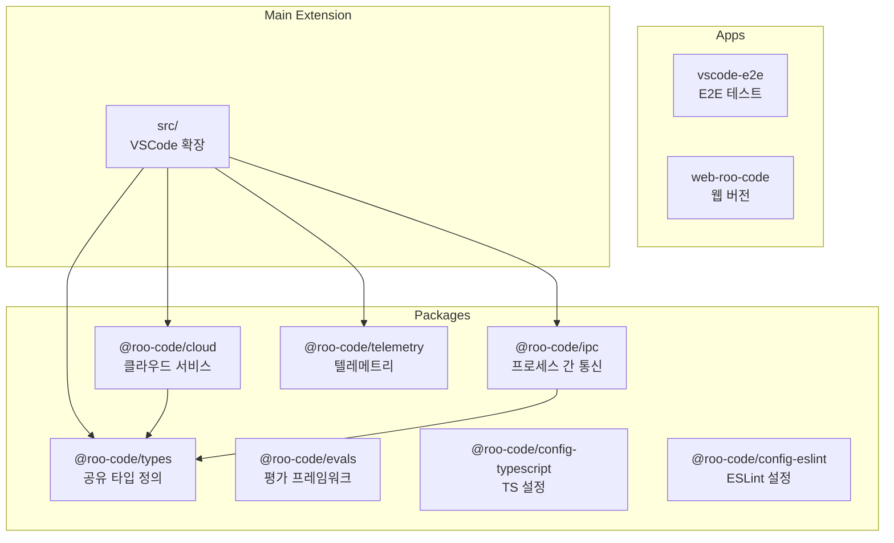
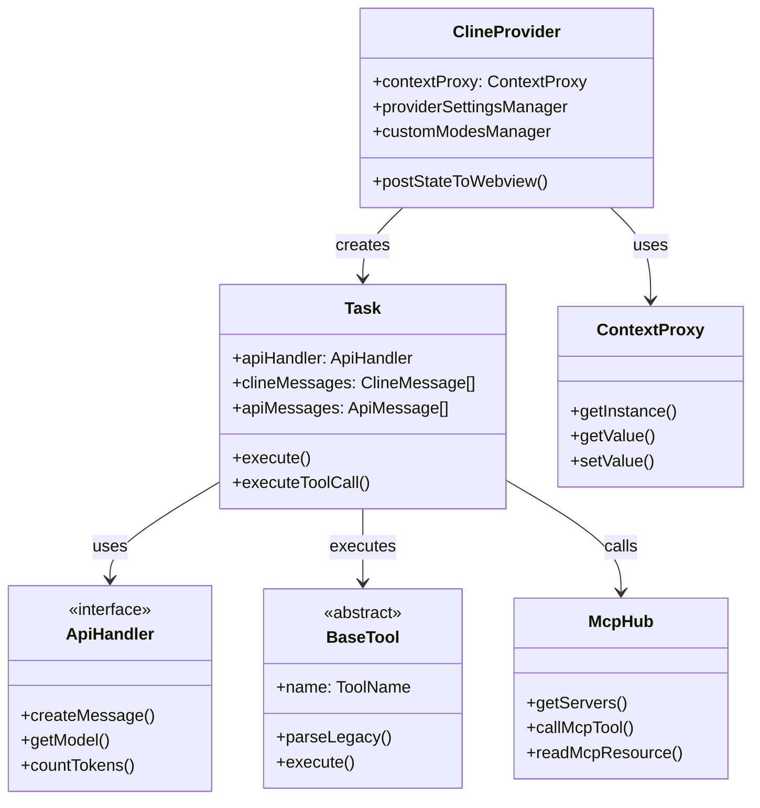
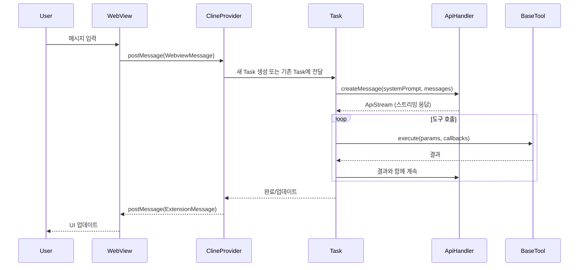

# Roo-Code 프로젝트 개요

> 이 문서는 Roo-Code 프로젝트를 분석하여 **Jupyter 기반 hdsp-agent** 개발에 도움이 될 인사이트를 제공합니다.

## 목차
1. [프로젝트 소개](#프로젝트-소개)
2. [기술 스택](#기술-스택)
3. [모노레포 구조](#모노레포-구조)
4. [디렉토리 구조](#디렉토리-구조)
5. [핵심 컴포넌트](#핵심-컴포넌트)
6. [Jupyter 에이전트 관점의 인사이트](#jupyter-에이전트-관점의-인사이트)

---

## 프로젝트 소개

### Roo-Code란?

Roo-Code는 VSCode 확장 프로그램 형태의 **AI 코딩 어시스턴트**입니다. Claude, GPT, Gemini 등 45개 이상의 AI 제공자를 지원하며, 코드 편집, 파일 관리, 터미널 명령 실행, 브라우저 자동화 등 다양한 도구를 AI 에이전트에게 제공합니다.

### 핵심 기능

| 기능 | 설명 |
|------|------|
| **다중 AI 제공자 지원** | Anthropic, OpenAI, Google, AWS Bedrock, Azure 등 45+ 제공자 |
| **도구 시스템** | 파일 읽기/쓰기, 검색, 터미널 실행, 브라우저 등 20+ 도구 |
| **MCP 통합** | Model Context Protocol 서버 연동 지원 |
| **컨텍스트 관리** | 대화 압축, 잘라내기, 체크포인트 기능 |
| **모드 시스템** | 역할별 도구 필터링 및 커스텀 지시사항 |
| **다국어 지원** | 18개 이상 언어 지원 (i18n) |

### 규모

```
총 TypeScript 파일: 803개
API 제공자: 45+
코어 도구: 20+
지원 언어: 18+
워크스페이스 패키지: 7개
```

---

## 기술 스택

### 런타임 및 빌드

| 기술 | 버전 | 용도 |
|------|------|------|
| **Node.js** | 20.19.2 | 런타임 환경 |
| **TypeScript** | 5.4.5 | 주 개발 언어 |
| **pnpm** | 10.8.1 | 패키지 매니저 |
| **Turbo** | 2.5.6 | 모노레포 빌드 오케스트레이션 |
| **esbuild** | 0.25.0 | 번들링 |
| **Vite** | - | 프론트엔드 빌드 |

### AI/ML 관련

| 라이브러리 | 용도 |
|------------|------|
| `@anthropic-ai/sdk` | Claude API 클라이언트 |
| `openai` | OpenAI API 클라이언트 |
| `@modelcontextprotocol/sdk` | MCP 프로토콜 구현 |
| `tiktoken` | 토큰 카운팅 |

### 프론트엔드

| 기술 | 용도 |
|------|------|
| **React** 18.3.1 | UI 프레임워크 |
| **Tailwind CSS** 4.0.0 | 스타일링 |
| **Shadcn UI** | 컴포넌트 라이브러리 |
| **React Query** | 서버 상태 관리 |

### 통신 및 유틸리티

| 라이브러리 | 용도 |
|------------|------|
| `node-ipc` | 프로세스 간 통신 |
| `socket.io-client` | WebSocket 통신 |
| `axios` | HTTP 클라이언트 |
| `zod` | 스키마 검증 |
| `web-tree-sitter` | 구문 분석 |

---

## 모노레포 구조

### pnpm Workspaces

```yaml
# pnpm-workspace.yaml
packages:
  - 'apps/*'
  - 'packages/*'
  - 'src'
```

### Turbo 파이프라인

```json
{
  "scripts": {
    "lint": "turbo lint --log-order grouped",
    "test": "turbo test --log-order grouped",
    "build": "turbo build --log-order grouped",
    "bundle": "turbo bundle --log-order grouped"
  }
}
```

### 워크스페이스 패키지



---

## 디렉토리 구조

```
Roo-Code/
├── apps/                          # 배포 애플리케이션
│   ├── vscode-e2e/               # VS Code E2E 테스트
│   ├── vscode-nightly/           # 나이틀리 빌드
│   ├── web-evals/                # 웹 평가 스위트
│   └── web-roo-code/             # 웹 버전
│
├── packages/                      # 공유 패키지
│   ├── build/                    # 빌드 설정
│   ├── cloud/                    # 클라우드 서비스 통합
│   ├── config-eslint/            # ESLint 설정
│   ├── config-typescript/        # TypeScript 설정
│   ├── evals/                    # 평가 프레임워크
│   ├── ipc/                      # 프로세스 간 통신
│   ├── telemetry/                # 분석/텔레메트리
│   └── types/                    # 공유 타입 정의
│
├── src/                           # 메인 확장 소스 (803개 TS 파일)
│   ├── api/                      # API 제공자 및 변환
│   ├── activate/                 # VS Code 활성화 핸들러
│   ├── core/                     # 핵심 에이전트 로직
│   ├── extension/                # 확장 API
│   ├── i18n/                     # 국제화
│   ├── integrations/             # VS Code 통합
│   ├── services/                 # 공유 서비스
│   ├── shared/                   # 공유 유틸리티 및 타입
│   ├── utils/                    # 일반 유틸리티
│   └── workers/                  # 워커 스레드
│
├── webview-ui/                    # React 프론트엔드 UI
│   └── src/                      # React 컴포넌트
│
├── locales/                       # i18n 번역 파일 (18+ 언어)
├── .roo/                          # 커스텀 Roo Code 설정
└── .roomodes                      # 커스텀 모드 정의
```

### src/ 상세 구조

```
src/
├── api/
│   ├── providers/                # 45+ AI 제공자 구현
│   │   ├── anthropic.ts
│   │   ├── openai.ts
│   │   ├── bedrock.ts
│   │   └── ...
│   ├── transform/                # 메시지 변환
│   │   ├── stream.ts            # 스트리밍 처리
│   │   └── ...
│   └── index.ts                  # buildApiHandler() 팩토리
│
├── core/
│   ├── task/
│   │   └── Task.ts              # 핵심 오케스트레이션 (1000+ 줄)
│   ├── tools/
│   │   ├── BaseTool.ts          # 추상 도구 클래스
│   │   └── [20+ 도구 구현]
│   ├── webview/
│   │   └── ClineProvider.ts     # UI 조정 (100+ KB)
│   ├── prompts/
│   │   └── system.ts            # 시스템 프롬프트 생성
│   ├── config/
│   │   └── ContextProxy.ts      # 상태 관리
│   ├── context-management/       # 컨텍스트 처리
│   ├── message-manager/          # 메시지 흐름
│   ├── checkpoints/              # 체크포인트 시스템
│   └── condense/                 # 대화 압축
│
├── services/
│   ├── mcp/
│   │   ├── McpHub.ts            # MCP 서버 허브
│   │   └── McpServerManager.ts  # 서버 관리자
│   ├── code-index/              # 코드 인덱싱
│   └── mdm/                     # MDM 서비스
│
└── integrations/
    ├── terminal/                # 터미널 통합
    ├── editor/                  # 에디터 통합
    └── browser/                 # 브라우저 통합
```

---

## 핵심 컴포넌트

### 1. 확장 진입점 (`extension.ts`)

```typescript
// 활성화 흐름
export async function activate(context: vscode.ExtensionContext) {
  // 1. 텔레메트리 초기화
  const telemetryService = TelemetryService.createInstance()

  // 2. i18n 초기화
  initializeI18n(language)

  // 3. 터미널 쉘 핸들러 초기화
  TerminalRegistry.initialize()

  // 4. ContextProxy 초기화 (상태 관리)
  const contextProxy = await ContextProxy.getInstance(context)

  // 5. 코드 인덱스 매니저 초기화
  const codeIndexManagers = []

  // 6. ClineProvider 생성 (핵심 UI 컨트롤러)
  const provider = new ClineProvider(context, outputChannel, "sidebar", contextProxy)

  // 7. CloudService 초기화
  cloudService = await CloudService.createInstance(context, cloudLogger, handlers)

  // 8. 명령 등록
  registerCommands({ context, outputChannel, provider })

  // 9. 코드 액션 등록
  registerCodeActions(context)
  registerTerminalActions(context)

  return new API(outputChannel, provider, socketPath, enableLogging)
}
```

### 2. 핵심 클래스 관계



### 3. 메시지 흐름



---

## Jupyter 에이전트 관점의 인사이트

### 아키텍처 매핑

| Roo-Code (VSCode) | hdsp-agent (Jupyter) | 설명 |
|-------------------|---------------------|------|
| `vscode.ExtensionContext` | `JupyterLab.ServiceManager` | 확장 컨텍스트 |
| `ClineProvider` | `KernelSessionManager` | UI 및 상태 관리 |
| `Task` | `CellExecutionManager` | 실행 단위 관리 |
| `BaseTool` | `MagicCommand` / `CodeExecutor` | 도구 실행 |
| `WebView` | `JupyterLab Panel` | 사용자 인터페이스 |
| `McpHub` | `KernelMcpBridge` | MCP 통합 |
| `globalState/secrets` | `Jupyter ConfigManager` | 설정 저장 |
| `ContextProxy` | `NotebookStateProxy` | 상태 프록시 |

### 핵심 적용 패턴

#### 1. Provider 추상화

Roo-Code가 45+ AI 제공자를 추상화한 것처럼, hdsp-agent에서는 다양한 Jupyter 커널을 추상화할 수 있습니다.

```python
# Python 예시 (개념적)
class KernelProvider(ABC):
    @abstractmethod
    async def execute(self, code: str) -> ExecutionResult:
        pass

    @abstractmethod
    def get_kernel_info(self) -> KernelInfo:
        pass

class IPythonKernel(KernelProvider):
    ...

class RKernel(KernelProvider):
    ...
```

#### 2. 도구 시스템

Roo-Code의 `BaseTool` 패턴을 Jupyter Magic Command와 통합할 수 있습니다.

```python
# Python 예시 (개념적)
class BaseTool(ABC):
    @property
    @abstractmethod
    def name(self) -> str:
        pass

    @abstractmethod
    async def execute(self, params: dict, context: ExecutionContext) -> ToolResult:
        pass

class ExecuteCodeTool(BaseTool):
    name = "execute_code"

    async def execute(self, params: dict, context: ExecutionContext) -> ToolResult:
        kernel = context.kernel
        result = await kernel.execute(params["code"])
        return ToolResult(success=True, output=result)
```

#### 3. 컨텍스트 관리

노트북 셀 히스토리를 LLM 컨텍스트 윈도우로 관리하는 전략:

```python
# 개념적 구조
class NotebookContextManager:
    def __init__(self, max_tokens: int):
        self.max_tokens = max_tokens
        self.cells: List[CellContext] = []

    def add_cell(self, cell: CellContext):
        self.cells.append(cell)
        self._manage_context_window()

    def _manage_context_window(self):
        total_tokens = sum(c.tokens for c in self.cells)
        if total_tokens > self.max_tokens * 0.9:
            # 압축 또는 잘라내기 전략 적용
            self._condense_or_truncate()
```

#### 4. MCP 통합

Jupyter 커널을 MCP 서버로 노출하는 브릿지 패턴:

```python
# 개념적 구조
class JupyterMcpBridge:
    def __init__(self, kernel_manager):
        self.kernel = kernel_manager
        self.tools = self._register_tools()

    def _register_tools(self) -> List[McpTool]:
        return [
            McpTool(name="execute_python", handler=self.execute_python),
            McpTool(name="get_variables", handler=self.get_variables),
            McpTool(name="plot_chart", handler=self.plot_chart),
        ]
```

### 권장 구현 우선순위

1. **Provider 추상화** (필수)
   - 다양한 LLM API 지원
   - 통합된 스트리밍 인터페이스

2. **도구 시스템** (필수)
   - 코드 실행 도구
   - 변수 검사 도구
   - 시각화 도구

3. **메시지 관리** (필수)
   - 이중 히스토리 (UI/API)
   - 비파괴적 되감기

4. **컨텍스트 관리** (중요)
   - 토큰 카운팅
   - 압축/잘라내기 전략

5. **MCP 통합** (선택)
   - 외부 도구 확장성
   - 커널 브릿지

---

## 다음 문서

- [01-아키텍처-패턴.md](./01-아키텍처-패턴.md) - 핵심 아키텍처 패턴 상세
