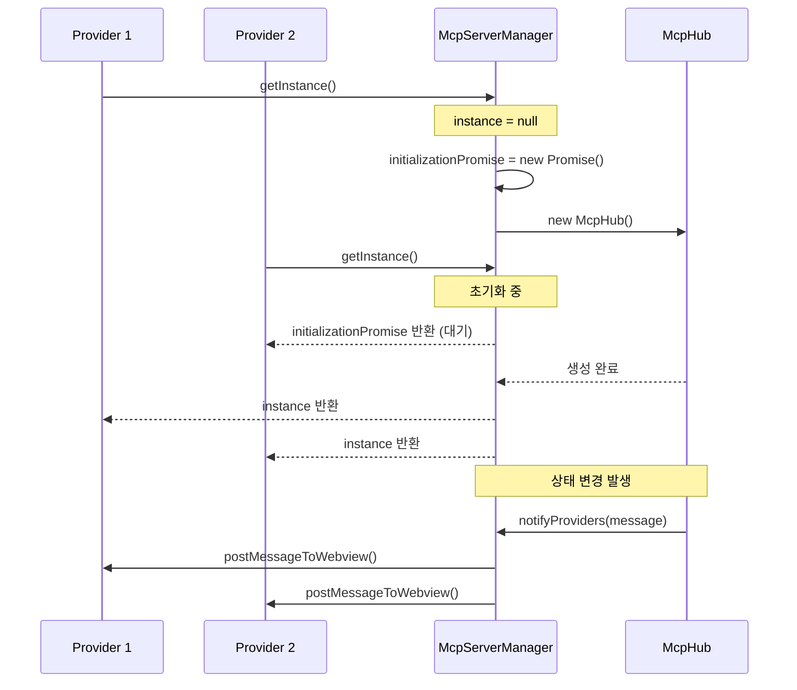
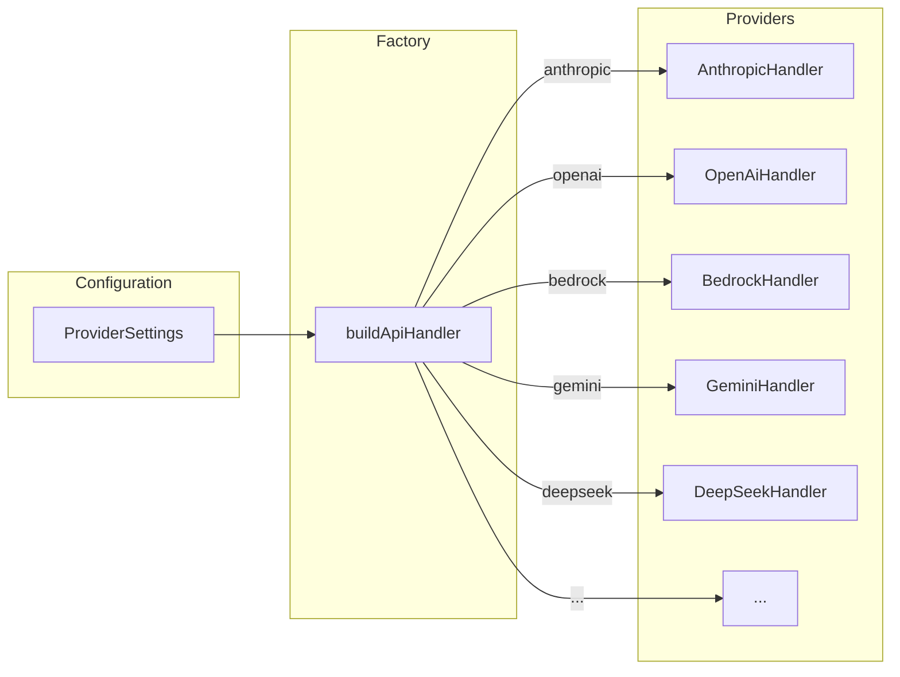
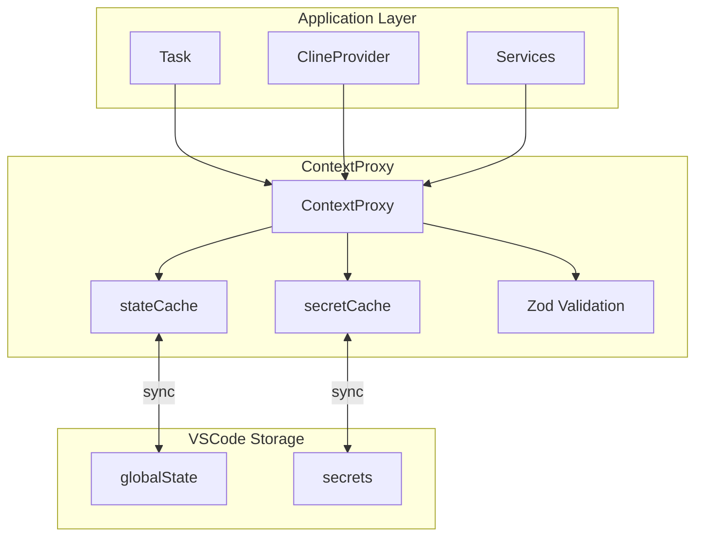
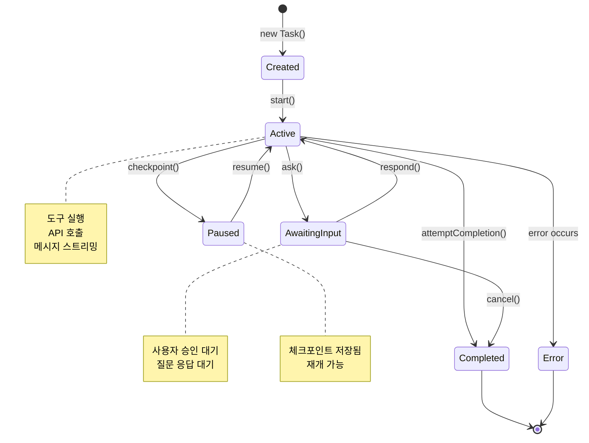
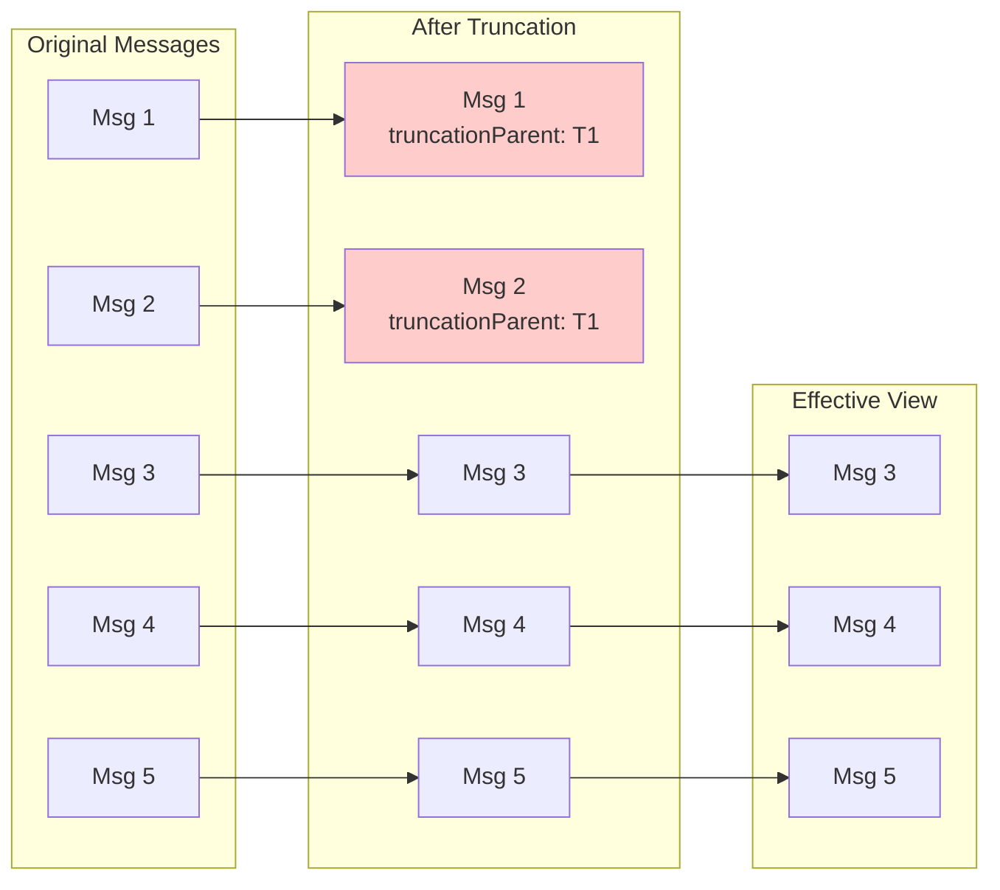

# 핵심 아키텍처 패턴

> Roo-Code에서 사용되는 핵심 아키텍처 패턴을 분석하고, Jupyter 기반 hdsp-agent에 적용할 수 있는 방법을 제시합니다.

## 목차
1. [싱글톤 + 이벤트 드리븐 패턴](#1-싱글톤--이벤트-드리븐-패턴)
2. [Provider 추상화 패턴](#2-provider-추상화-패턴)
3. [팩토리 패턴](#3-팩토리-패턴)
4. [프록시 패턴 (ContextProxy)](#4-프록시-패턴-contextproxy)
5. [상태 머신 패턴](#5-상태-머신-패턴)
6. [비파괴적 히스토리 관리](#6-비파괴적-히스토리-관리)
7. [판별 합집합 (Discriminated Union)](#7-판별-합집합-discriminated-union)
8. [Jupyter 적용 가이드](#8-jupyter-적용-가이드)

---

## 1. 싱글톤 + 이벤트 드리븐 패턴

### 개념

Roo-Code는 비용이 많이 드는 리소스(MCP 서버, 클라우드 서비스 등)를 관리하기 위해 **싱글톤 패턴**과 **이벤트 드리븐 패턴**을 결합합니다.

### 실제 구현: McpServerManager

```typescript
// src/services/mcp/McpServerManager.ts

/**
 * Singleton manager for MCP server instances.
 * Ensures only one set of MCP servers runs across all webviews.
 */
export class McpServerManager {
    // 싱글톤 인스턴스
    private static instance: McpHub | null = null

    // 초기화 Promise (동시 접근 방지)
    private static initializationPromise: Promise<McpHub> | null = null

    // 구독자(Provider) 추적
    private static providers: Set<ClineProvider> = new Set()

    /**
     * Thread-safe implementation using a promise-based lock.
     */
    static async getInstance(
        context: vscode.ExtensionContext,
        provider: ClineProvider
    ): Promise<McpHub> {
        // Provider 등록
        this.providers.add(provider)

        // 이미 인스턴스가 있으면 반환
        if (this.instance) {
            return this.instance
        }

        // 초기화 중이면 대기
        if (this.initializationPromise) {
            return this.initializationPromise
        }

        // 새 초기화 Promise 생성
        this.initializationPromise = (async () => {
            try {
                // Double-check locking
                if (!this.instance) {
                    this.instance = new McpHub(provider)
                    await context.globalState.update(
                        this.GLOBAL_STATE_KEY,
                        Date.now().toString()
                    )
                }
                return this.instance
            } finally {
                this.initializationPromise = null
            }
        })()

        return this.initializationPromise
    }

    /**
     * Notify all registered providers of server state changes.
     * 이벤트 브로드캐스트 패턴
     */
    static notifyProviders(message: any): void {
        this.providers.forEach((provider) => {
            provider.postMessageToWebview(message).catch((error) => {
                console.error("Failed to notify provider:", error)
            })
        })
    }

    /**
     * Clean up the singleton instance and all its resources.
     */
    static async cleanup(context: vscode.ExtensionContext): Promise<void> {
        if (this.instance) {
            await this.instance.dispose()
            this.instance = null
            await context.globalState.update(this.GLOBAL_STATE_KEY, undefined)
        }
        this.providers.clear()
    }
}
```

### 핵심 특징

| 특징 | 설명 |
|------|------|
| **Promise 기반 락** | 동시 초기화 방지 |
| **Double-check locking** | 경쟁 조건 방지 |
| **Provider 등록** | 다중 구독자 지원 |
| **브로드캐스트** | 상태 변경 전파 |
| **정리 메서드** | 리소스 해제 보장 |

### 다이어그램



---

## 2. Provider 추상화 패턴

### 개념

45개 이상의 AI 제공자를 **단일 인터페이스**로 추상화하여 교체 가능하게 만듭니다.

### 인터페이스 정의

```typescript
// src/api/index.ts

export interface ApiHandler {
    /**
     * 메시지 생성 (스트리밍)
     */
    createMessage(
        systemPrompt: string,
        messages: Anthropic.Messages.MessageParam[],
        metadata?: ApiHandlerCreateMessageMetadata,
    ): ApiStream

    /**
     * 모델 정보 반환
     */
    getModel(): { id: string; info: ModelInfo }

    /**
     * 토큰 카운팅
     * 기본값: tiktoken 구현
     * 제공자별 오버라이드 가능
     */
    countTokens(
        content: Array<Anthropic.Messages.ContentBlockParam>
    ): Promise<number>
}

export interface ApiHandlerCreateMessageMetadata {
    taskId: string
    mode?: string
    suppressPreviousResponseId?: boolean
    store?: boolean
    tools?: OpenAI.Chat.ChatCompletionTool[]
    tool_choice?: OpenAI.Chat.ChatCompletionCreateParams["tool_choice"]
    toolProtocol?: ToolProtocol  // "xml" | "native"
    parallelToolCalls?: boolean
}
```

### 기본 Provider 구현

```typescript
// 개념적 구현 (실제 BaseProvider.ts 기반)

export abstract class BaseProvider implements ApiHandler {
    protected options: ProviderOptions

    constructor(options: ProviderOptions) {
        this.options = options
    }

    abstract createMessage(
        systemPrompt: string,
        messages: MessageParam[],
        metadata?: ApiHandlerCreateMessageMetadata
    ): ApiStream

    abstract getModel(): { id: string; info: ModelInfo }

    /**
     * 기본 tiktoken 구현
     * 제공자가 자체 토큰 카운팅 API를 가지고 있으면 오버라이드
     */
    async countTokens(
        content: Array<ContentBlockParam>
    ): Promise<number> {
        // tiktoken 기반 기본 구현
        return tiktokenCountTokens(content)
    }

    /**
     * OpenAI 도구 스키마를 제공자별 형식으로 변환
     */
    protected convertToolsForProvider(
        tools: OpenAI.Chat.ChatCompletionTool[]
    ): ProviderSpecificTools {
        // 기본 구현 또는 오버라이드
    }
}
```

### 지원 제공자 목록 (일부)

| 제공자 | 핸들러 클래스 | 특징 |
|--------|--------------|------|
| Anthropic | `AnthropicHandler` | Claude 모델, 네이티브 SDK |
| OpenAI | `OpenAiHandler` | GPT 모델, Function calling |
| AWS Bedrock | `AwsBedrockHandler` | AWS 인증, Claude/Titan |
| Google Vertex | `VertexHandler` | Gemini 모델 |
| Ollama | `NativeOllamaHandler` | 로컬 모델 |
| DeepSeek | `DeepSeekHandler` | DeepSeek 모델 |
| Groq | `GroqHandler` | 고속 추론 |
| ... | ... | 총 45+ 제공자 |

---

## 3. 팩토리 패턴

### buildApiHandler 팩토리

```typescript
// src/api/index.ts

export function buildApiHandler(configuration: ProviderSettings): ApiHandler {
    const { apiProvider, ...options } = configuration

    switch (apiProvider) {
        case "anthropic":
            return new AnthropicHandler(options)
        case "claude-code":
            return new ClaudeCodeHandler(options)
        case "openrouter":
            return new OpenRouterHandler(options)
        case "bedrock":
            return new AwsBedrockHandler(options)
        case "vertex":
            // 모델 ID에 따라 다른 핸들러 선택
            return options.apiModelId?.startsWith("claude")
                ? new AnthropicVertexHandler(options)
                : new VertexHandler(options)
        case "openai":
            return new OpenAiHandler(options)
        case "ollama":
            return new NativeOllamaHandler(options)
        case "gemini":
            return new GeminiHandler(options)
        case "deepseek":
            return new DeepSeekHandler(options)
        // ... 45+ 제공자
        default:
            // TypeScript exhaustiveness check
            apiProvider satisfies "gemini-cli" | undefined
            return new AnthropicHandler(options)
    }
}
```

### 팩토리 패턴 다이어그램



### 장점

1. **느슨한 결합**: 호출자는 구체적인 제공자 구현을 몰라도 됨
2. **확장성**: 새 제공자 추가 시 switch 문에 케이스만 추가
3. **설정 기반**: 런타임에 제공자 변경 가능
4. **타입 안전성**: TypeScript의 exhaustiveness check 활용

---

## 4. 프록시 패턴 (ContextProxy)

### 개념

VSCode의 `globalState`와 `secrets`를 **캐싱 레이어**로 감싸서 성능을 최적화하고, 일관된 API를 제공합니다.

### 구현

```typescript
// src/core/config/ContextProxy.ts

export class ContextProxy {
    private readonly originalContext: vscode.ExtensionContext

    // 캐시 레이어
    private stateCache: GlobalState
    private secretCache: SecretState
    private _isInitialized = false

    constructor(context: vscode.ExtensionContext) {
        this.originalContext = context
        this.stateCache = {}
        this.secretCache = {}
    }

    /**
     * 초기화: 모든 상태를 캐시로 로드
     */
    public async initialize() {
        // Global State 로드
        for (const key of GLOBAL_STATE_KEYS) {
            try {
                this.stateCache[key] = this.originalContext.globalState.get(key)
            } catch (error) {
                logger.error(`Error loading global ${key}`)
            }
        }

        // Secrets 로드 (비동기)
        const promises = [
            ...SECRET_STATE_KEYS.map(async (key) => {
                this.secretCache[key] = await this.originalContext.secrets.get(key)
            }),
            ...GLOBAL_SECRET_KEYS.map(async (key) => {
                this.secretCache[key] = await this.originalContext.secrets.get(key)
            }),
        ]
        await Promise.all(promises)

        // 마이그레이션 실행
        await this.migrateImageGenerationSettings()
        await this.migrateInvalidApiProvider()

        this._isInitialized = true
    }

    /**
     * Global State 읽기 (캐시 우선)
     */
    getGlobalState<K extends GlobalStateKey>(key: K): GlobalState[K] {
        // 특정 키는 항상 원본에서 읽기 (대용량 데이터)
        if (isPassThroughStateKey(key)) {
            return this.originalContext.globalState.get<GlobalState[K]>(key)
        }
        return this.stateCache[key]
    }

    /**
     * Global State 쓰기 (캐시 + 원본 동시 업데이트)
     */
    updateGlobalState<K extends GlobalStateKey>(key: K, value: GlobalState[K]) {
        if (isPassThroughStateKey(key)) {
            return this.originalContext.globalState.update(key, value)
        }
        this.stateCache[key] = value
        return this.originalContext.globalState.update(key, value)
    }

    /**
     * Secret 읽기 (캐시에서)
     */
    getSecret(key: SecretStateKey) {
        return this.secretCache[key]
    }

    /**
     * Secret 쓰기 (캐시 + 원본 동시)
     */
    storeSecret(key: SecretStateKey, value?: string) {
        this.secretCache[key] = value
        return value === undefined
            ? this.originalContext.secrets.delete(key)
            : this.originalContext.secrets.store(key, value)
    }

    /**
     * Zod 스키마로 검증된 Provider 설정 반환
     */
    public getProviderSettings(): ProviderSettings {
        const values = this.getValues()
        const sanitizedValues = this.sanitizeProviderValues(values)

        try {
            return providerSettingsSchema.parse(sanitizedValues)
        } catch (error) {
            if (error instanceof ZodError) {
                TelemetryService.instance.captureSchemaValidationError({
                    schemaName: "ProviderSettings",
                    error
                })
            }
            // 폴백: 검증 없이 반환
            return PROVIDER_SETTINGS_KEYS.reduce(
                (acc, key) => ({ ...acc, [key]: sanitizedValues[key] }),
                {} as ProviderSettings,
            )
        }
    }

    /**
     * 싱글톤 인스턴스 접근
     */
    private static _instance: ContextProxy | null = null

    static async getInstance(context: vscode.ExtensionContext) {
        if (this._instance) {
            return this._instance
        }
        this._instance = new ContextProxy(context)
        await this._instance.initialize()
        return this._instance
    }
}
```

### ContextProxy 아키텍처



### 핵심 기능

| 기능 | 설명 |
|------|------|
| **캐싱** | 메모리에 상태 캐시하여 빠른 읽기 |
| **동기화** | 쓰기 시 캐시와 원본 동시 업데이트 |
| **Zod 검증** | 스키마 기반 런타임 타입 검증 |
| **마이그레이션** | 설정 구조 변경 시 자동 마이그레이션 |
| **Pass-through** | 대용량 데이터는 캐시 우회 |
| **싱글톤** | 전역 단일 인스턴스 |

---

## 5. 상태 머신 패턴

### Task 생명주기

Roo-Code의 Task는 명확한 상태 전이를 가집니다:



### 상태 타입 정의

```typescript
// packages/types/src/task.ts (개념적)

type TaskStatus =
    | "created"
    | "active"
    | "awaiting_input"
    | "paused"
    | "completed"
    | "error"

interface TaskState {
    status: TaskStatus
    currentAsk?: ClineAsk
    error?: Error
    checkpoint?: CheckpointData
}
```

### 상태 전이 핸들러

```typescript
// 개념적 구현

class Task extends EventEmitter<TaskEvents> {
    private state: TaskState = { status: "created" }

    private transition(newStatus: TaskStatus, data?: Partial<TaskState>) {
        const previousStatus = this.state.status
        this.state = { ...this.state, ...data, status: newStatus }

        this.emit("state_change", {
            previousStatus,
            newStatus,
            data
        })
    }

    async start() {
        this.transition("active")
        await this.executeLoop()
    }

    async ask(type: ClineAsk, question: string) {
        this.transition("awaiting_input", { currentAsk: type })
        // 사용자 응답 대기
    }

    respond(response: string) {
        this.transition("active", { currentAsk: undefined })
        // 응답 처리 계속
    }

    checkpoint() {
        const data = this.serialize()
        this.transition("paused", { checkpoint: data })
    }

    resume() {
        this.transition("active", { checkpoint: undefined })
    }
}
```

---

## 6. 비파괴적 히스토리 관리

### 개념

메시지를 삭제하는 대신 **마커**를 사용하여 논리적으로 제외합니다. 이를 통해 되감기(rewind) 기능을 구현할 수 있습니다.

### 마커 기반 관리

```typescript
// packages/types/src/message.ts (개념적)

interface ClineMessage {
    ts: number                    // 타임스탬프 (고유 ID)
    type: "ask" | "say"
    ask?: ClineAsk
    say?: ClineSay
    text?: string

    // 마커 필드들
    condenseParent?: number       // 요약으로 대체된 메시지의 부모 타임스탬프
    truncationParent?: number     // 잘라내기로 제외된 메시지의 부모 타임스탬프
    isAnswered?: boolean          // ask에 대한 응답 완료 여부
    progressStatus?: number       // 진행 상태
}
```

### 비파괴적 잘라내기

```typescript
// 개념적 구현

function truncateConversation(
    messages: ClineMessage[],
    fracToRemove: number
): TruncationResult {
    const numToRemove = Math.floor(messages.length * fracToRemove)
    const truncationTs = Date.now()

    // 실제로 삭제하지 않고 마커만 추가
    const truncatedMessages = messages.map((msg, index) => {
        if (index < numToRemove) {
            return {
                ...msg,
                truncationParent: truncationTs  // 마커 추가
            }
        }
        return msg
    })

    return {
        messages: truncatedMessages,
        truncationTs,
        removedCount: numToRemove
    }
}

// 유효한 메시지만 필터링
function getEffectiveMessages(messages: ClineMessage[]): ClineMessage[] {
    return messages.filter(msg =>
        !msg.truncationParent && !msg.condenseParent
    )
}
```

### 되감기 구현

```typescript
// src/core/message-manager/MessageManager.ts (개념적)

class MessageManager {
    private messages: ClineMessage[] = []

    /**
     * 특정 타임스탬프로 되감기
     * 마커가 있는 메시지들도 복원됨
     */
    rewindToTimestamp(
        ts: number,
        options?: { includeTargetMessage?: boolean }
    ) {
        const targetIndex = this.messages.findIndex(m => m.ts === ts)

        if (targetIndex === -1) {
            throw new Error(`Message with ts ${ts} not found`)
        }

        // 해당 시점 이후의 모든 마커 제거
        this.messages = this.messages.map((msg, index) => {
            if (index <= targetIndex) {
                // 되감기 범위 내 메시지의 마커 제거
                const { truncationParent, condenseParent, ...rest } = msg
                return rest
            }
            return msg
        }).slice(0, targetIndex + (options?.includeTargetMessage ? 1 : 0))

        // 고아 요약 정리
        this.cleanupOrphanedSummaries()
    }

    private cleanupOrphanedSummaries() {
        // condenseParent가 더 이상 존재하지 않는 메시지 정리
        const validParents = new Set(this.messages.map(m => m.ts))
        this.messages = this.messages.filter(msg => {
            if (msg.condenseParent) {
                return validParents.has(msg.condenseParent)
            }
            return true
        })
    }
}
```

### 히스토리 관리 다이어그램



---

## 7. 판별 합집합 (Discriminated Union)

### 개념

TypeScript의 **판별 합집합**을 사용하여 타입 안전한 메시지 처리를 구현합니다.

### 스트림 청크 타입

```typescript
// src/api/transform/stream.ts

type ApiStreamChunk =
    | ApiStreamTextChunk
    | ApiStreamUsageChunk
    | ApiStreamReasoningChunk
    | ApiStreamToolCallChunk
    | ApiStreamToolCallStartChunk
    | ApiStreamToolCallDeltaChunk
    | ApiStreamToolCallEndChunk
    | ApiStreamError

interface ApiStreamTextChunk {
    type: "text"
    text: string
}

interface ApiStreamUsageChunk {
    type: "usage"
    inputTokens: number
    outputTokens: number
    cacheReadInputTokens?: number
    cacheCreationInputTokens?: number
}

interface ApiStreamReasoningChunk {
    type: "reasoning"
    reasoning: string
}

interface ApiStreamToolCallChunk {
    type: "tool_call"
    name: string
    params: Record<string, unknown>
}

interface ApiStreamToolCallStartChunk {
    type: "tool_call_start"
    id: string
    name: string
}

interface ApiStreamToolCallDeltaChunk {
    type: "tool_call_delta"
    id: string
    argumentsDelta: string
}

interface ApiStreamToolCallEndChunk {
    type: "tool_call_end"
    id: string
}

interface ApiStreamError {
    type: "error"
    error: Error
}
```

### 타입 안전한 처리

```typescript
// 스트림 처리 예시

async function processStream(stream: ApiStream) {
    for await (const chunk of stream) {
        switch (chunk.type) {
            case "text":
                // TypeScript가 chunk.text를 알고 있음
                handleText(chunk.text)
                break

            case "usage":
                // chunk.inputTokens, chunk.outputTokens 접근 가능
                updateTokenUsage(chunk.inputTokens, chunk.outputTokens)
                break

            case "tool_call":
                // chunk.name, chunk.params 접근 가능
                await executeToolCall(chunk.name, chunk.params)
                break

            case "tool_call_start":
                // 스트리밍 도구 호출 시작
                startToolCallBuffer(chunk.id, chunk.name)
                break

            case "tool_call_delta":
                // 인자 델타 누적
                appendToolCallArguments(chunk.id, chunk.argumentsDelta)
                break

            case "tool_call_end":
                // 도구 호출 완료
                finalizeToolCall(chunk.id)
                break

            case "error":
                // 오류 처리
                handleError(chunk.error)
                break

            default:
                // TypeScript exhaustiveness check
                const _exhaustive: never = chunk
        }
    }
}
```

### MCP 연결 상태

```typescript
// 연결 상태 판별 합집합

type McpConnection =
    | ConnectedMcpConnection
    | DisconnectedMcpConnection

interface ConnectedMcpConnection {
    status: "connected"
    server: McpServer
    client: McpClient
    transport: McpTransport
}

interface DisconnectedMcpConnection {
    status: "disconnected"
    server: McpServer
    error?: Error
    lastAttempt?: number
}

// 타입 가드
function isConnected(conn: McpConnection): conn is ConnectedMcpConnection {
    return conn.status === "connected"
}

// 사용
function callTool(conn: McpConnection, toolName: string, args: unknown) {
    if (isConnected(conn)) {
        // conn.client, conn.transport 접근 가능
        return conn.client.callTool(toolName, args)
    } else {
        // conn.error 접근 가능
        throw new Error(`Server disconnected: ${conn.error?.message}`)
    }
}
```

---

## 8. Jupyter 적용 가이드

### 싱글톤 + 이벤트 드리븐 → Kernel Manager

```python
# Python 예시

from typing import Set, Optional
import asyncio

class KernelManager:
    _instance: Optional['KernelSession'] = None
    _initialization_lock = asyncio.Lock()
    _subscribers: Set['NotebookPanel'] = set()

    @classmethod
    async def get_instance(cls, panel: 'NotebookPanel') -> 'KernelSession':
        cls._subscribers.add(panel)

        if cls._instance:
            return cls._instance

        async with cls._initialization_lock:
            if not cls._instance:
                cls._instance = await KernelSession.create()

        return cls._instance

    @classmethod
    def notify_subscribers(cls, event: dict):
        for panel in cls._subscribers:
            panel.on_kernel_event(event)

    @classmethod
    async def cleanup(cls):
        if cls._instance:
            await cls._instance.shutdown()
            cls._instance = None
        cls._subscribers.clear()
```

### Provider 추상화 → Kernel Provider

```python
from abc import ABC, abstractmethod
from typing import AsyncIterator

class KernelProvider(ABC):
    @abstractmethod
    async def execute(self, code: str) -> AsyncIterator[ExecutionResult]:
        """코드 실행 (스트리밍)"""
        pass

    @abstractmethod
    def get_kernel_info(self) -> KernelInfo:
        """커널 정보"""
        pass

    @abstractmethod
    async def get_completions(self, code: str, cursor_pos: int) -> list[Completion]:
        """자동완성"""
        pass

class IPythonKernel(KernelProvider):
    async def execute(self, code: str) -> AsyncIterator[ExecutionResult]:
        # IPython 커널 구현
        ...

class RKernel(KernelProvider):
    async def execute(self, code: str) -> AsyncIterator[ExecutionResult]:
        # R 커널 구현
        ...

def build_kernel(config: KernelConfig) -> KernelProvider:
    """팩토리 함수"""
    match config.kernel_type:
        case "python":
            return IPythonKernel(config)
        case "r":
            return RKernel(config)
        case "julia":
            return JuliaKernel(config)
        case _:
            return IPythonKernel(config)  # 기본값
```

### ContextProxy → Notebook State Proxy

```python
from dataclasses import dataclass
from typing import Any, Optional
import json

@dataclass
class NotebookStateProxy:
    """노트북 상태 프록시"""

    _state_cache: dict[str, Any]
    _notebook_path: str
    _is_initialized: bool = False

    @classmethod
    async def create(cls, notebook_path: str) -> 'NotebookStateProxy':
        proxy = cls(
            _state_cache={},
            _notebook_path=notebook_path
        )
        await proxy.initialize()
        return proxy

    async def initialize(self):
        # 노트북 메타데이터에서 상태 로드
        metadata = await self._load_metadata()
        self._state_cache = metadata.get("hdsp_agent", {})
        self._is_initialized = True

    def get(self, key: str, default: Any = None) -> Any:
        return self._state_cache.get(key, default)

    async def set(self, key: str, value: Any):
        self._state_cache[key] = value
        await self._save_metadata()

    async def _load_metadata(self) -> dict:
        # 노트북 파일에서 메타데이터 로드
        ...

    async def _save_metadata(self):
        # 노트북 파일에 메타데이터 저장
        ...
```

### 판별 합집합 → Python Dataclass

```python
from dataclasses import dataclass
from typing import Union, Literal

@dataclass
class TextChunk:
    type: Literal["text"] = "text"
    text: str = ""

@dataclass
class CodeChunk:
    type: Literal["code"] = "code"
    code: str = ""
    language: str = "python"

@dataclass
class OutputChunk:
    type: Literal["output"] = "output"
    output_type: str = "stream"
    data: Any = None

@dataclass
class ErrorChunk:
    type: Literal["error"] = "error"
    error: Exception = None

# 판별 합집합
StreamChunk = Union[TextChunk, CodeChunk, OutputChunk, ErrorChunk]

# 타입 가드 (Python 3.10+ match문)
def process_chunk(chunk: StreamChunk):
    match chunk:
        case TextChunk(text=text):
            print(f"Text: {text}")
        case CodeChunk(code=code, language=lang):
            print(f"Code ({lang}): {code}")
        case OutputChunk(data=data):
            print(f"Output: {data}")
        case ErrorChunk(error=err):
            print(f"Error: {err}")
```

---

## 다음 문서

- [02-에이전트-구현.md](./02-에이전트-구현.md) - AI 에이전트 구현 패턴
