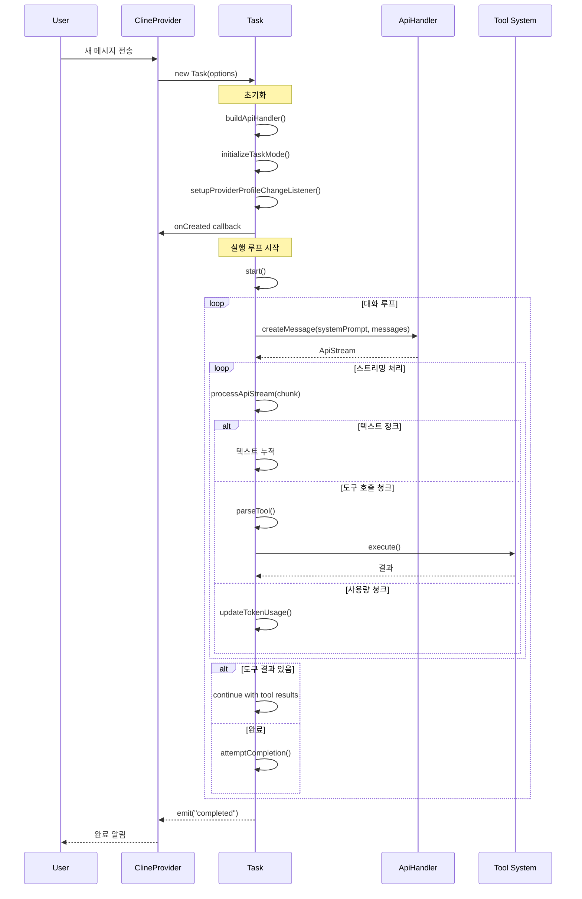
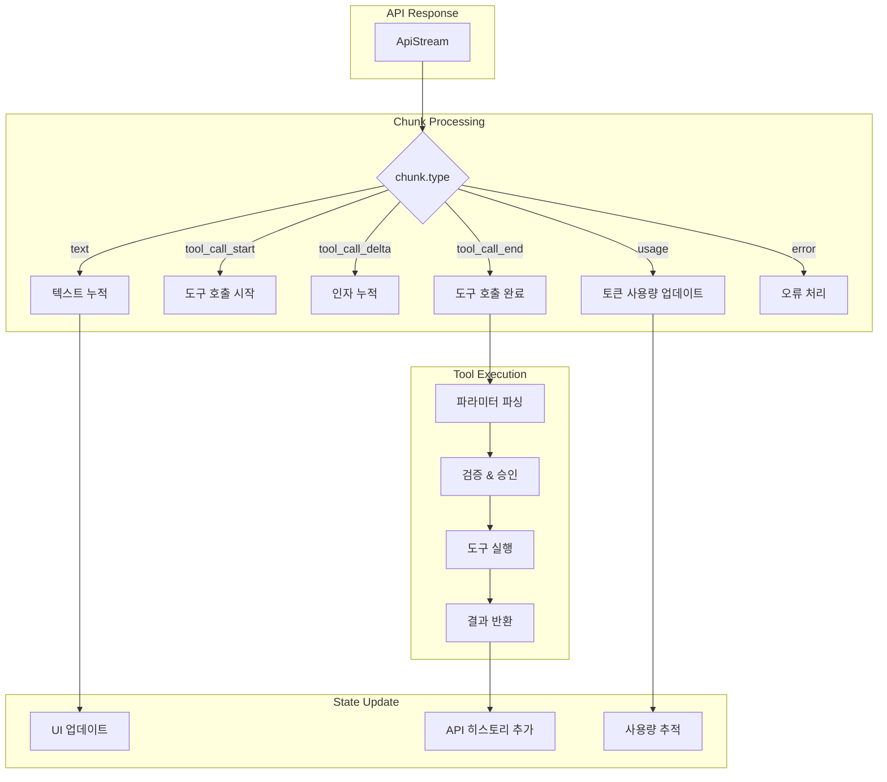
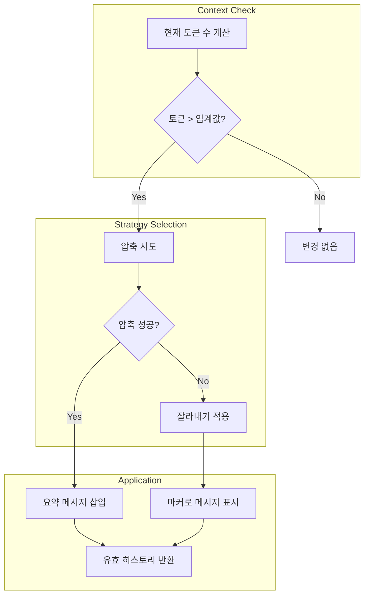
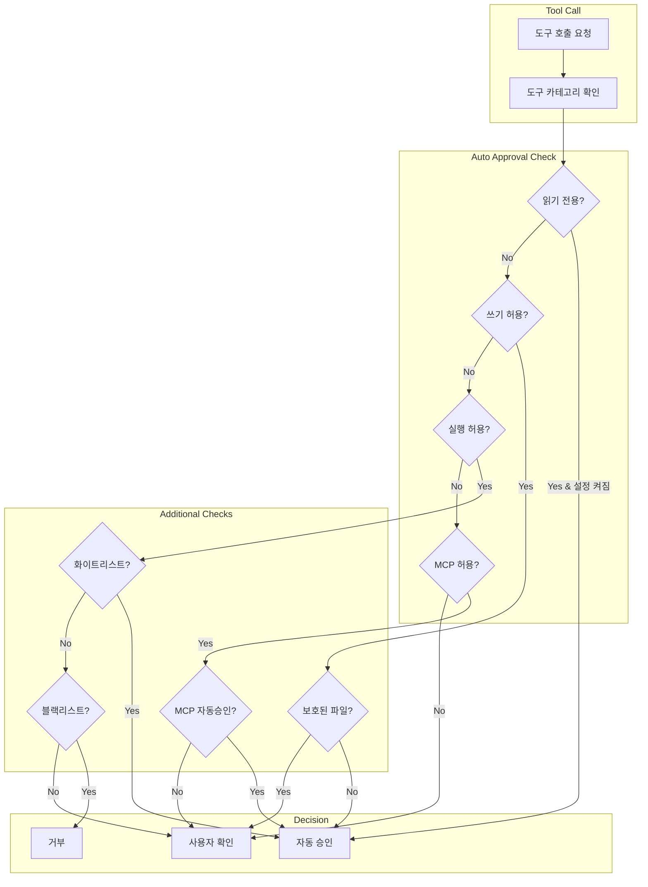
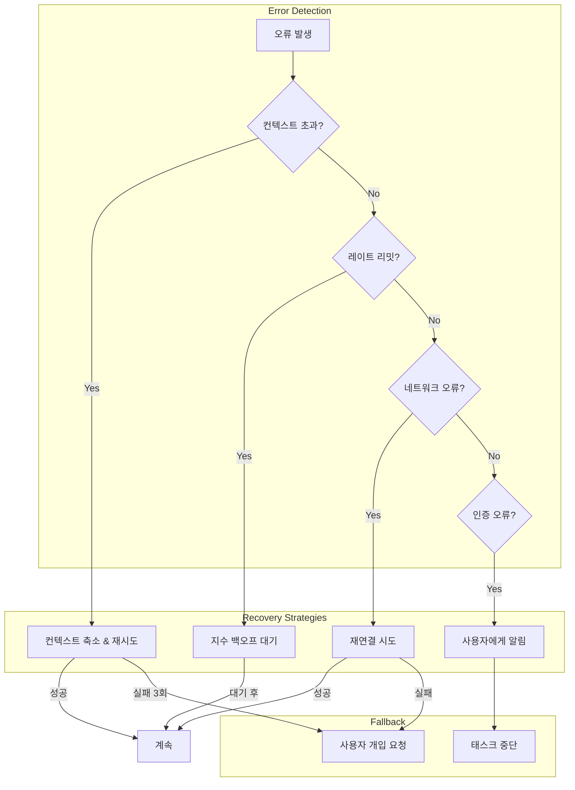

# AI 에이전트 구현 패턴

> Roo-Code의 AI 에이전트 구현을 분석하고, Jupyter 기반 hdsp-agent에 적용할 수 있는 핵심 패턴을 제시합니다.

## 목차
1. [Task 실행 엔진](#1-task-실행-엔진)
2. [메시지 스트리밍 및 파싱](#2-메시지-스트리밍-및-파싱)
3. [컨텍스트 관리 시스템](#3-컨텍스트-관리-시스템)
4. [자동 승인 시스템](#4-자동-승인-시스템)
5. [오류 처리 및 재시도 전략](#5-오류-처리-및-재시도-전략)
6. [Jupyter 적용 가이드](#6-jupyter-적용-가이드)

---

## 1. Task 실행 엔진

### Task 클래스 개요

`Task` 클래스는 Roo-Code의 **핵심 오케스트레이터**입니다. AI와의 대화, 도구 실행, 상태 관리를 모두 담당합니다.

```typescript
// src/core/task/Task.ts

export class Task extends EventEmitter<TaskEvents> implements TaskLike {
    // === 식별자 ===
    readonly taskId: string           // 고유 Task ID
    readonly rootTaskId?: string      // 루트 Task (서브태스크용)
    readonly parentTaskId?: string    // 부모 Task (서브태스크용)
    readonly instanceId: string       // 인스턴스 식별자
    readonly metadata: TaskMetadata   // 태스크 메타데이터

    // === 상태 관리 ===
    abort: boolean = false
    isInitialized: boolean = false
    isPaused: boolean = false

    // === API 관련 ===
    apiConfiguration: ProviderSettings
    api: ApiHandler
    private autoApprovalHandler: AutoApprovalHandler

    // === 메시지 히스토리 ===
    apiConversationHistory: ApiMessage[] = []   // API용 대화 히스토리
    clineMessages: ClineMessage[] = []          // UI용 메시지 히스토리

    // === 스트리밍 상태 ===
    isStreaming: boolean = false
    assistantMessageContent: AssistantMessageContent[] = []
    assistantMessageParser?: AssistantMessageParser

    // === 도구 관련 ===
    consecutiveMistakeCount: number = 0
    consecutiveMistakeLimit: number
    toolUsage: ToolUsage = {}
    toolRepetitionDetector: ToolRepetitionDetector

    // === 브라우저/터미널 ===
    browserSession: BrowserSession
    terminalProcess?: RooTerminalProcess

    // === 체크포인트 ===
    enableCheckpoints: boolean
    checkpointService?: RepoPerTaskCheckpointService
}
```

### Task 생명주기



### 핵심 메서드

#### 1. 초기화

```typescript
constructor(options: TaskOptions) {
    // 1. 식별자 설정
    this.taskId = historyItem ? historyItem.id : crypto.randomUUID()

    // 2. 컨트롤러 초기화
    this.rooIgnoreController = new RooIgnoreController(this.cwd)
    this.rooProtectedController = new RooProtectedController(this.cwd)
    this.fileContextTracker = new FileContextTracker(provider, this.taskId)

    // 3. API 핸들러 생성
    this.apiConfiguration = apiConfiguration
    this.api = buildApiHandler(apiConfiguration)
    this.autoApprovalHandler = new AutoApprovalHandler()

    // 4. 브라우저/터미널 세션
    this.browserSession = new BrowserSession(provider.context, callback)

    // 5. 모드 초기화 (비동기)
    if (historyItem) {
        this._taskMode = historyItem.mode || defaultModeSlug
        this.taskModeReady = Promise.resolve()
    } else {
        this.taskModeReady = this.initializeTaskMode(provider)
    }

    // 6. 메시지 파서 (XML 프로토콜용)
    const toolProtocol = resolveToolProtocol(this.apiConfiguration, modelInfo)
    this.assistantMessageParser = toolProtocol !== "native"
        ? new AssistantMessageParser()
        : undefined

    // 7. 메시지 큐 서비스
    this.messageQueueService = new MessageQueueService()
}
```

#### 2. API 호출 메타데이터

```typescript
interface ApiHandlerCreateMessageMetadata {
    taskId: string                    // 추적용 Task ID
    mode?: string                     // 현재 모드 슬러그
    suppressPreviousResponseId?: boolean
    store?: boolean                   // OpenAI 응답 저장 여부
    tools?: OpenAI.Chat.ChatCompletionTool[]
    tool_choice?: ToolChoice
    toolProtocol?: ToolProtocol       // "xml" | "native"
    parallelToolCalls?: boolean       // 병렬 도구 호출 허용
}
```

#### 3. 이중 히스토리 시스템

```typescript
// API용 히스토리 (LLM에 전달)
apiConversationHistory: ApiMessage[] = []

// UI용 히스토리 (사용자에게 표시)
clineMessages: ClineMessage[] = []

// 두 히스토리는 별도로 관리됨
// - apiConversationHistory: 컨텍스트 관리, 압축 적용
// - clineMessages: UI 표시, 비파괴적 관리
```

---

## 2. 메시지 스트리밍 및 파싱

### ApiStream 타입

```typescript
// src/api/transform/stream.ts

export type ApiStream = AsyncGenerator<ApiStreamChunk>

type ApiStreamChunk =
    | ApiStreamTextChunk
    | ApiStreamUsageChunk
    | ApiStreamReasoningChunk
    | ApiStreamToolCallChunk
    | ApiStreamToolCallStartChunk
    | ApiStreamToolCallDeltaChunk
    | ApiStreamToolCallEndChunk
    | ApiStreamError

interface ApiStreamTextChunk {
    type: "text"
    text: string
}

interface ApiStreamUsageChunk {
    type: "usage"
    inputTokens: number
    outputTokens: number
    cacheReadInputTokens?: number
    cacheCreationInputTokens?: number
}

interface ApiStreamToolCallStartChunk {
    type: "tool_call_start"
    id: string
    name: string
}

interface ApiStreamToolCallDeltaChunk {
    type: "tool_call_delta"
    id: string
    argumentsDelta: string  // JSON 조각
}

interface ApiStreamToolCallEndChunk {
    type: "tool_call_end"
    id: string
}
```

### AssistantMessageParser (XML 프로토콜)

XML 프로토콜을 사용할 때 어시스턴트 메시지를 파싱합니다:

```typescript
// src/core/assistant-message/AssistantMessageParser.ts (개념적)

class AssistantMessageParser {
    private buffer: string = ""
    private currentToolUse?: ToolUse

    /**
     * 스트리밍 텍스트 청크를 파싱
     */
    addChunk(text: string): AssistantMessageContent[] {
        this.buffer += text
        return this.parseBuffer()
    }

    private parseBuffer(): AssistantMessageContent[] {
        const results: AssistantMessageContent[] = []

        // XML 태그 탐지: <tool_name>...</tool_name>
        const toolMatch = this.buffer.match(/<(\w+)>([\s\S]*?)<\/\1>/)

        if (toolMatch) {
            const [fullMatch, toolName, content] = toolMatch

            // 도구 호출 파싱
            const params = this.parseToolParams(content)
            results.push({
                type: "tool_use",
                name: toolName as ToolName,
                params
            })

            // 버퍼에서 제거
            this.buffer = this.buffer.replace(fullMatch, "")
        }

        // 남은 텍스트 콘텐츠
        if (this.buffer.trim()) {
            results.push({
                type: "text",
                content: this.buffer
            })
        }

        return results
    }

    private parseToolParams(content: string): Record<string, string> {
        const params: Record<string, string> = {}
        // <param_name>value</param_name> 형식 파싱
        const paramRegex = /<(\w+)>([\s\S]*?)<\/\1>/g
        let match
        while ((match = paramRegex.exec(content))) {
            params[match[1]] = match[2]
        }
        return params
    }
}
```

### NativeToolCallParser (Native 프로토콜)

OpenAI 스타일의 네이티브 도구 호출을 파싱합니다:

```typescript
// src/core/assistant-message/NativeToolCallParser.ts (개념적)

class NativeToolCallParser {
    private toolCalls: Map<string, PendingToolCall> = new Map()

    /**
     * 도구 호출 시작
     */
    onToolCallStart(id: string, name: string) {
        this.toolCalls.set(id, {
            id,
            name,
            argumentsBuffer: ""
        })
    }

    /**
     * 인자 델타 추가
     */
    onToolCallDelta(id: string, delta: string) {
        const call = this.toolCalls.get(id)
        if (call) {
            call.argumentsBuffer += delta
        }
    }

    /**
     * 도구 호출 완료
     */
    onToolCallEnd(id: string): ToolUse | undefined {
        const call = this.toolCalls.get(id)
        if (!call) return undefined

        try {
            const args = JSON.parse(call.argumentsBuffer)
            return {
                type: "tool_use",
                id: call.id,
                name: call.name,
                params: args
            }
        } catch (error) {
            console.error("Failed to parse tool arguments:", error)
            return undefined
        } finally {
            this.toolCalls.delete(id)
        }
    }
}
```

### 스트림 처리 흐름



---

## 3. 컨텍스트 관리 시스템

### 개요

Roo-Code는 두 가지 전략으로 컨텍스트 윈도우를 관리합니다:

1. **압축 (Condensation)**: 대화를 요약하여 토큰 절약
2. **잘라내기 (Truncation)**: 오래된 메시지를 논리적으로 제거

### 압축 전략 (Condensation)

```typescript
// src/core/condense/index.ts (개념적)

/**
 * 대화 요약 생성
 */
async function summarizeConversation(
    messages: ApiMessage[],
    apiHandler: ApiHandler
): Promise<SummarizeResponse> {
    // 마지막 요약 이후의 메시지만 가져오기
    const messagesToSummarize = getMessagesSinceLastSummary(messages)

    if (messagesToSummarize.length < MIN_MESSAGES_TO_SUMMARIZE) {
        return { shouldSummarize: false }
    }

    // 요약 프롬프트 생성
    const summaryPrompt = buildSummaryPrompt(messagesToSummarize)

    // API 호출로 요약 생성
    const summary = await apiHandler.createMessage(
        SUMMARY_SYSTEM_PROMPT,
        [{ role: "user", content: summaryPrompt }]
    )

    return {
        shouldSummarize: true,
        summary: summary.text,
        summarizedMessageCount: messagesToSummarize.length
    }
}

/**
 * 효과적인 API 히스토리 반환
 * (요약된 메시지는 제외하고 요약으로 대체)
 */
function getEffectiveApiHistory(messages: ApiMessage[]): ApiMessage[] {
    return messages.filter(msg => !msg.condenseParent)
}
```

### 잘라내기 전략 (Truncation)

```typescript
// src/core/context-management/index.ts (개념적)

const TOKEN_BUFFER_PERCENTAGE = 0.10  // 10% 버퍼

/**
 * 컨텍스트 관리 실행
 */
async function manageContext(
    messages: ApiMessage[],
    apiHandler: ApiHandler,
    maxTokens: number
): Promise<ContextManagementResult> {
    const currentTokens = await countTokens(messages, apiHandler)
    const threshold = maxTokens * (1 - TOKEN_BUFFER_PERCENTAGE)

    if (currentTokens < threshold) {
        return { action: "none", messages }
    }

    // 1차: 압축 시도
    const condensed = await summarizeConversation(messages, apiHandler)
    if (condensed.shouldSummarize) {
        return {
            action: "condensed",
            messages: applyCondensation(messages, condensed)
        }
    }

    // 2차: 잘라내기
    const truncated = truncateConversation(
        messages,
        0.25  // 25% 제거
    )

    return {
        action: "truncated",
        messages: truncated.messages,
        removedCount: truncated.removedCount
    }
}

/**
 * 컨텍스트 윈도우 초과 시 강제 축소
 */
function forcedContextReduction(
    messages: ApiMessage[],
    percentToKeep: number = 0.75
): ApiMessage[] {
    const numToRemove = Math.floor(messages.length * (1 - percentToKeep))
    const truncationTs = Date.now()

    return messages.map((msg, index) => {
        if (index < numToRemove) {
            return { ...msg, truncationParent: truncationTs }
        }
        return msg
    })
}
```

### 컨텍스트 관리 다이어그램



### 상수 및 설정

```typescript
// 컨텍스트 관리 상수
const TOKEN_BUFFER_PERCENTAGE = 0.10           // 10% 버퍼
const FORCED_CONTEXT_REDUCTION_PERCENT = 75    // 강제 축소 시 75% 유지
const MAX_CONTEXT_WINDOW_RETRIES = 3           // 최대 재시도 횟수
const MIN_MESSAGES_TO_SUMMARIZE = 5            // 최소 요약 메시지 수
```

---

## 4. 자동 승인 시스템

### 승인 상태 타입

```typescript
// packages/types/src/auto-approval.ts (개념적)

type AutoApprovalState =
    | "alwaysAllowReadOnly"          // 읽기 전용 작업 자동 승인
    | "alwaysAllowWrite"             // 쓰기 작업 자동 승인
    | "alwaysAllowBrowser"           // 브라우저 작업 자동 승인
    | "alwaysApproveResubmit"        // 재제출 자동 승인
    | "alwaysAllowMcp"               // MCP 도구 자동 승인
    | "alwaysAllowModeSwitch"        // 모드 전환 자동 승인
    | "alwaysAllowSubtasks"          // 서브태스크 자동 승인
    | "alwaysAllowExecute"           // 명령 실행 자동 승인
    | "alwaysAllowFollowupQuestions" // 후속 질문 자동 승인
    | "alwaysAllowUpdateTodoList"    // TODO 리스트 업데이트 자동 승인

interface AutoApprovalResult {
    decision: "approve" | "deny" | "ask" | "timeout"
    reason?: string
}
```

### AutoApprovalHandler

```typescript
// src/core/auto-approval/index.ts (개념적)

class AutoApprovalHandler {
    private settings: AutoApprovalSettings

    /**
     * 도구 호출에 대한 자동 승인 확인
     */
    checkAutoApproval(
        toolName: ToolName,
        params: Record<string, unknown>,
        context: ApprovalContext
    ): AutoApprovalResult {
        // 1. 도구 카테고리 확인
        const category = getToolCategory(toolName)

        // 2. 카테고리별 승인 설정 확인
        switch (category) {
            case "read":
                if (this.settings.alwaysAllowReadOnly) {
                    return { decision: "approve" }
                }
                break

            case "write":
                if (this.settings.alwaysAllowWrite) {
                    // 보호된 파일 체크
                    if (context.isProtectedFile(params.path)) {
                        return { decision: "ask", reason: "protected_file" }
                    }
                    return { decision: "approve" }
                }
                break

            case "execute":
                if (this.settings.alwaysAllowExecute) {
                    // 명령 화이트리스트 체크
                    if (context.isAllowedCommand(params.command)) {
                        return { decision: "approve" }
                    }
                    // 명령 블랙리스트 체크
                    if (context.isDeniedCommand(params.command)) {
                        return { decision: "deny" }
                    }
                }
                break

            case "mcp":
                if (this.settings.alwaysAllowMcp) {
                    // MCP 도구별 자동 승인 리스트 체크
                    if (this.settings.mcpToolAlwaysAllow?.includes(toolName)) {
                        return { decision: "approve" }
                    }
                }
                break
        }

        // 기본: 사용자에게 물어봄
        return { decision: "ask" }
    }
}
```

### 승인 흐름



---

## 5. 오류 처리 및 재시도 전략

### 상수 정의

```typescript
// src/core/task/Task.ts

const MAX_EXPONENTIAL_BACKOFF_SECONDS = 600  // 최대 10분 대기
const DEFAULT_USAGE_COLLECTION_TIMEOUT_MS = 5000  // 사용량 수집 타임아웃
const FORCED_CONTEXT_REDUCTION_PERCENT = 75  // 컨텍스트 오류 시 75% 유지
const MAX_CONTEXT_WINDOW_RETRIES = 3  // 컨텍스트 오류 최대 재시도
```

### 지수 백오프 재시도

```typescript
// 개념적 구현

async function withExponentialBackoff<T>(
    operation: () => Promise<T>,
    options: {
        maxRetries: number
        baseDelayMs: number
        maxDelayMs: number
        shouldRetry: (error: Error) => boolean
    }
): Promise<T> {
    let retries = 0

    while (true) {
        try {
            return await operation()
        } catch (error) {
            retries++

            if (retries >= options.maxRetries) {
                throw error
            }

            if (!options.shouldRetry(error)) {
                throw error
            }

            // 지수 백오프 계산
            const delay = Math.min(
                options.baseDelayMs * Math.pow(2, retries - 1),
                options.maxDelayMs
            )

            console.log(`Retry ${retries}/${options.maxRetries} after ${delay}ms`)
            await sleep(delay)
        }
    }
}
```

### 컨텍스트 윈도우 오류 처리

```typescript
// 개념적 구현

async function handleContextWindowError(
    task: Task,
    error: Error
): Promise<boolean> {
    // 컨텍스트 윈도우 초과 오류 확인
    if (!checkContextWindowExceededError(error)) {
        return false  // 다른 종류의 오류
    }

    // 재시도 횟수 확인
    if (task.contextWindowRetries >= MAX_CONTEXT_WINDOW_RETRIES) {
        throw new Error("Max context window retries exceeded")
    }

    task.contextWindowRetries++

    // 강제 컨텍스트 축소
    task.apiConversationHistory = forcedContextReduction(
        task.apiConversationHistory,
        FORCED_CONTEXT_REDUCTION_PERCENT / 100
    )

    // 트렁케이션 이벤트 기록
    await task.say("context_truncation", {
        percentKept: FORCED_CONTEXT_REDUCTION_PERCENT,
        reason: "context_window_exceeded"
    })

    return true  // 재시도 필요
}
```

### 연속 실수 추적

```typescript
// Task 클래스 내부

class Task {
    consecutiveMistakeCount: number = 0
    consecutiveMistakeLimit: number

    /**
     * 도구 실행 실패 시 호출
     */
    onToolError(toolName: ToolName, error: Error) {
        this.consecutiveMistakeCount++

        if (this.consecutiveMistakeCount >= this.consecutiveMistakeLimit) {
            // 사용자에게 개입 요청
            this.ask("consecutive_mistakes", {
                count: this.consecutiveMistakeCount,
                lastTool: toolName,
                lastError: error.message
            })
        }
    }

    /**
     * 도구 실행 성공 시 호출
     */
    onToolSuccess() {
        this.consecutiveMistakeCount = 0
    }
}
```

### 오류 유형별 처리



---

## 6. Jupyter 적용 가이드

### Task → CellExecutionManager

```python
from dataclasses import dataclass, field
from typing import List, Optional, Dict, Any
from enum import Enum
import asyncio
import uuid

class ExecutionStatus(Enum):
    CREATED = "created"
    ACTIVE = "active"
    AWAITING_INPUT = "awaiting_input"
    PAUSED = "paused"
    COMPLETED = "completed"
    ERROR = "error"

@dataclass
class CellExecutionManager:
    """Jupyter 노트북 셀 실행 관리자"""

    # 식별자
    execution_id: str = field(default_factory=lambda: str(uuid.uuid4()))
    notebook_path: str = ""

    # 상태
    status: ExecutionStatus = ExecutionStatus.CREATED
    is_streaming: bool = False

    # 히스토리 (이중 히스토리 시스템)
    api_history: List[Dict[str, Any]] = field(default_factory=list)
    cell_messages: List[Dict[str, Any]] = field(default_factory=list)

    # 도구 관련
    consecutive_mistakes: int = 0
    consecutive_mistake_limit: int = 3

    # 컨텍스트 관리
    max_context_tokens: int = 100000
    context_window_retries: int = 0

    async def execute(self, user_input: str) -> AsyncIterator[StreamChunk]:
        """메인 실행 루프"""
        self.status = ExecutionStatus.ACTIVE

        try:
            # 사용자 메시지 추가
            self.add_user_message(user_input)

            while True:
                # API 호출
                async for chunk in self.call_api():
                    yield chunk

                    # 도구 호출 처리
                    if chunk.type == "tool_call_end":
                        result = await self.execute_tool(chunk.tool_call)

                        if result.requires_continuation:
                            continue
                        else:
                            break

                # 완료 확인
                if self.should_complete():
                    break

            self.status = ExecutionStatus.COMPLETED

        except ContextWindowExceededError:
            await self.handle_context_window_error()
            # 재시도
            async for chunk in self.execute(user_input):
                yield chunk

        except Exception as e:
            self.status = ExecutionStatus.ERROR
            yield ErrorChunk(error=e)

    async def handle_context_window_error(self):
        """컨텍스트 윈도우 오류 처리"""
        self.context_window_retries += 1

        if self.context_window_retries > 3:
            raise MaxRetriesExceededError()

        # 강제 컨텍스트 축소
        self.api_history = self.truncate_history(
            self.api_history,
            keep_percent=0.75
        )
```

### 스트리밍 처리

```python
from dataclasses import dataclass
from typing import Union, Literal, AsyncIterator

@dataclass
class TextChunk:
    type: Literal["text"] = "text"
    text: str = ""

@dataclass
class ToolCallStartChunk:
    type: Literal["tool_call_start"] = "tool_call_start"
    id: str = ""
    name: str = ""

@dataclass
class ToolCallDeltaChunk:
    type: Literal["tool_call_delta"] = "tool_call_delta"
    id: str = ""
    arguments_delta: str = ""

@dataclass
class ToolCallEndChunk:
    type: Literal["tool_call_end"] = "tool_call_end"
    id: str = ""
    tool_call: Optional['ToolCall'] = None

@dataclass
class UsageChunk:
    type: Literal["usage"] = "usage"
    input_tokens: int = 0
    output_tokens: int = 0

@dataclass
class ErrorChunk:
    type: Literal["error"] = "error"
    error: Exception = None

StreamChunk = Union[
    TextChunk,
    ToolCallStartChunk,
    ToolCallDeltaChunk,
    ToolCallEndChunk,
    UsageChunk,
    ErrorChunk
]


class StreamProcessor:
    """스트림 청크 처리기"""

    def __init__(self):
        self.pending_tool_calls: Dict[str, PendingToolCall] = {}

    async def process(
        self,
        stream: AsyncIterator[StreamChunk]
    ) -> AsyncIterator[ProcessedContent]:
        async for chunk in stream:
            match chunk:
                case TextChunk(text=text):
                    yield TextContent(text=text)

                case ToolCallStartChunk(id=id, name=name):
                    self.pending_tool_calls[id] = PendingToolCall(
                        id=id,
                        name=name,
                        arguments_buffer=""
                    )

                case ToolCallDeltaChunk(id=id, arguments_delta=delta):
                    if id in self.pending_tool_calls:
                        self.pending_tool_calls[id].arguments_buffer += delta

                case ToolCallEndChunk(id=id):
                    if id in self.pending_tool_calls:
                        call = self.pending_tool_calls.pop(id)
                        yield ToolCallContent(
                            id=call.id,
                            name=call.name,
                            arguments=json.loads(call.arguments_buffer)
                        )

                case UsageChunk(input_tokens=inp, output_tokens=out):
                    yield UsageContent(
                        input_tokens=inp,
                        output_tokens=out
                    )

                case ErrorChunk(error=error):
                    raise error
```

### 컨텍스트 관리

```python
from typing import List, Dict, Any, Optional
import tiktoken

class NotebookContextManager:
    """노트북 컨텍스트 관리자"""

    def __init__(self, max_tokens: int = 100000):
        self.max_tokens = max_tokens
        self.buffer_percentage = 0.10  # 10% 버퍼
        self.encoder = tiktoken.get_encoding("cl100k_base")

    def count_tokens(self, messages: List[Dict[str, Any]]) -> int:
        """메시지 토큰 수 계산"""
        total = 0
        for msg in messages:
            content = msg.get("content", "")
            if isinstance(content, str):
                total += len(self.encoder.encode(content))
            elif isinstance(content, list):
                for block in content:
                    if block.get("type") == "text":
                        total += len(self.encoder.encode(block["text"]))
        return total

    def should_manage_context(self, messages: List[Dict[str, Any]]) -> bool:
        """컨텍스트 관리 필요 여부"""
        current_tokens = self.count_tokens(messages)
        threshold = self.max_tokens * (1 - self.buffer_percentage)
        return current_tokens > threshold

    async def manage_context(
        self,
        messages: List[Dict[str, Any]],
        llm_client: 'LLMClient'
    ) -> ContextManagementResult:
        """컨텍스트 관리 실행"""
        if not self.should_manage_context(messages):
            return ContextManagementResult(action="none", messages=messages)

        # 1차: 압축 시도
        summary_result = await self.try_summarize(messages, llm_client)
        if summary_result.success:
            return ContextManagementResult(
                action="condensed",
                messages=summary_result.messages
            )

        # 2차: 잘라내기
        truncated = self.truncate(messages, keep_percent=0.75)
        return ContextManagementResult(
            action="truncated",
            messages=truncated
        )

    def truncate(
        self,
        messages: List[Dict[str, Any]],
        keep_percent: float = 0.75
    ) -> List[Dict[str, Any]]:
        """비파괴적 잘라내기"""
        num_to_remove = int(len(messages) * (1 - keep_percent))
        truncation_marker = {"timestamp": time.time()}

        result = []
        for i, msg in enumerate(messages):
            if i < num_to_remove:
                # 마커만 추가, 삭제하지 않음
                result.append({
                    **msg,
                    "truncation_parent": truncation_marker["timestamp"]
                })
            else:
                result.append(msg)

        return result

    def get_effective_messages(
        self,
        messages: List[Dict[str, Any]]
    ) -> List[Dict[str, Any]]:
        """유효한 메시지만 반환"""
        return [
            msg for msg in messages
            if not msg.get("truncation_parent")
            and not msg.get("condense_parent")
        ]
```

### 자동 승인 시스템

```python
from enum import Enum
from dataclasses import dataclass
from typing import Optional, Set

class ApprovalDecision(Enum):
    APPROVE = "approve"
    DENY = "deny"
    ASK = "ask"
    TIMEOUT = "timeout"

@dataclass
class AutoApprovalSettings:
    allow_read_only: bool = True
    allow_write: bool = False
    allow_execute: bool = False
    allowed_commands: Set[str] = field(default_factory=set)
    denied_commands: Set[str] = field(default_factory=set)

@dataclass
class ApprovalResult:
    decision: ApprovalDecision
    reason: Optional[str] = None

class AutoApprovalHandler:
    """자동 승인 핸들러"""

    def __init__(self, settings: AutoApprovalSettings):
        self.settings = settings

    def check_approval(
        self,
        tool_name: str,
        params: Dict[str, Any],
        context: 'ExecutionContext'
    ) -> ApprovalResult:
        """도구 실행 승인 확인"""

        # 도구 카테고리 확인
        category = self.get_tool_category(tool_name)

        if category == "read":
            if self.settings.allow_read_only:
                return ApprovalResult(ApprovalDecision.APPROVE)

        elif category == "write":
            if self.settings.allow_write:
                return ApprovalResult(ApprovalDecision.APPROVE)

        elif category == "execute":
            command = params.get("command", "")

            # 블랙리스트 체크
            if self.is_command_denied(command):
                return ApprovalResult(
                    ApprovalDecision.DENY,
                    reason="command_blacklisted"
                )

            # 화이트리스트 체크
            if self.settings.allow_execute:
                if self.is_command_allowed(command):
                    return ApprovalResult(ApprovalDecision.APPROVE)

        # 기본: 사용자에게 물어봄
        return ApprovalResult(ApprovalDecision.ASK)

    def get_tool_category(self, tool_name: str) -> str:
        """도구 카테고리 반환"""
        read_tools = {"read_file", "list_files", "search_files"}
        write_tools = {"write_file", "edit_file", "delete_file"}
        execute_tools = {"execute_command", "run_code"}

        if tool_name in read_tools:
            return "read"
        elif tool_name in write_tools:
            return "write"
        elif tool_name in execute_tools:
            return "execute"
        return "other"
```

---

## 다음 문서

- [03-도구-시스템.md](./03-도구-시스템.md) - 도구(Tool) 시스템 상세
