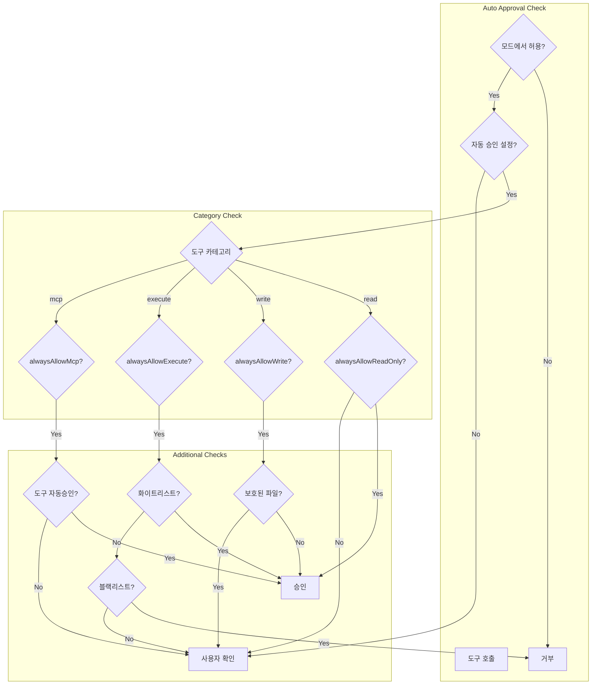

# 도구(Tool) 시스템

> Roo-Code의 도구 시스템을 분석하고, Jupyter 기반 hdsp-agent에 적용할 수 있는 패턴을 제시합니다.

## 목차
1. [BaseTool 추상 클래스](#1-basetool-추상-클래스)
2. [이중 프로토콜 지원](#2-이중-프로토콜-지원)
3. [도구 목록 및 역할](#3-도구-목록-및-역할)
4. [도구 실행 흐름](#4-도구-실행-흐름)
5. [권한 및 승인 시스템](#5-권한-및-승인-시스템)
6. [Jupyter 적용 가이드](#6-jupyter-적용-가이드)

---

## 1. BaseTool 추상 클래스

### 핵심 구조

```typescript
// src/core/tools/BaseTool.ts

/**
 * 모든 도구의 추상 기본 클래스
 *
 * 아키텍처:
 * - XML/레거시 프로토콜: params → parseLegacy() → 타입된 params → execute()
 * - 네이티브 프로토콜: nativeArgs가 이미 타입된 데이터 → execute()
 */
export abstract class BaseTool<TName extends ToolName> {
    /**
     * 도구 이름 (ToolName 타입과 일치해야 함)
     */
    abstract readonly name: TName

    /**
     * XML/레거시 문자열 파라미터를 타입된 파라미터로 파싱
     */
    abstract parseLegacy(
        params: Partial<Record<string, string>>
    ): ToolParams<TName>

    /**
     * 타입된 파라미터로 도구 실행
     * 프로토콜에 독립적인 핵심 로직
     */
    abstract execute(
        params: ToolParams<TName>,
        task: Task,
        callbacks: ToolCallbacks
    ): Promise<void>

    /**
     * 스트리밍 부분 메시지 처리 (선택적)
     * 기본 구현은 아무것도 하지 않음
     */
    async handlePartial(task: Task, block: ToolUse<TName>): Promise<void> {
        // 기본: 부분 메시지에 대해 아무것도 안함
        // 스트리밍 UI 업데이트를 위해 오버라이드 가능
    }

    /**
     * 메인 진입점
     * 1. 부분 메시지 처리
     * 2. 파라미터 파싱 (XML용 parseLegacy 또는 직접 nativeArgs 사용)
     * 3. 핵심 실행 (execute)
     */
    async handle(
        task: Task,
        block: ToolUse<TName>,
        callbacks: ToolCallbacks
    ): Promise<void> {
        // 부분 메시지 처리
        if (block.partial) {
            try {
                await this.handlePartial(task, block)
            } catch (error) {
                await callbacks.handleError(
                    `handling partial ${this.name}`,
                    error instanceof Error ? error : new Error(String(error))
                )
            }
            return
        }

        // 프로토콜 결정 및 파라미터 파싱
        let params: ToolParams<TName>
        try {
            if (block.nativeArgs !== undefined) {
                // 네이티브 프로토콜: NativeToolCallParser가 제공한 타입된 args
                params = block.nativeArgs as ToolParams<TName>
            } else {
                // XML/레거시 프로토콜: 문자열 params를 타입된 params로 파싱
                params = this.parseLegacy(block.params)
            }
        } catch (error) {
            const errorMessage = `Failed to parse ${this.name} parameters`
            await callbacks.handleError(`parsing ${this.name} args`, new Error(errorMessage))
            callbacks.pushToolResult(`<error>${errorMessage}</error>`)
            return
        }

        // 타입된 파라미터로 실행
        await this.execute(params, task, callbacks)
    }

    /**
     * 스트리밍 중 부분 닫는 XML 태그 제거
     */
    protected removeClosingTag(
        tag: string,
        text: string | undefined,
        isPartial: boolean
    ): string {
        if (!isPartial || !text) {
            return text || ""
        }

        const tagRegex = new RegExp(
            `\\s?<\/?${tag
                .split("")
                .map((char) => `(?:${char})?`)
                .join("")}$`,
            "g"
        )

        return text.replace(tagRegex, "")
    }
}
```

### ToolCallbacks 인터페이스

```typescript
// src/core/tools/BaseTool.ts

export interface ToolCallbacks {
    /**
     * 승인 요청
     */
    askApproval: (
        type: ClineAsk,
        partialMessage?: string,
        progressStatus?: ToolProgressStatus,
        forceApproval?: boolean
    ) => Promise<boolean>

    /**
     * 오류 처리
     */
    handleError: (action: string, error: Error) => Promise<void>

    /**
     * 도구 결과 푸시
     */
    pushToolResult: (content: ToolResponse) => void

    /**
     * 닫는 태그 제거
     */
    removeClosingTag: (tag: ToolParamName, content?: string) => string

    /**
     * 현재 도구 프로토콜
     */
    toolProtocol: ToolProtocol

    /**
     * 도구 호출 ID (네이티브 프로토콜)
     */
    toolCallId?: string
}
```

---

## 2. 이중 프로토콜 지원

### XML 프로토콜

```xml
<!-- 모델이 생성하는 XML 형식 -->
<read_file>
    <path>/src/main.ts</path>
    <start_line>1</start_line>
    <end_line>50</end_line>
</read_file>

<execute_command>
    <command>npm install</command>
    <cwd>/project</cwd>
</execute_command>

<write_to_file>
    <path>/src/utils.ts</path>
    <content>
export function helper() {
    return "hello"
}
    </content>
</write_to_file>
```

### 네이티브 프로토콜 (OpenAI 스타일)

```json
{
    "type": "function",
    "function": {
        "name": "read_file",
        "arguments": {
            "files": [
                {
                    "path": "/src/main.ts",
                    "start_line": 1,
                    "end_line": 50
                }
            ]
        }
    }
}
```

### NativeToolArgs 타입 맵

```typescript
// src/shared/tools.ts

/**
 * 각 도구의 네이티브(타입된) 인자 구조 정의
 * 여기에 없는 도구는 하위 호환성을 위해 `any`로 폴백
 */
export type NativeToolArgs = {
    access_mcp_resource: { server_name: string; uri: string }
    read_file: { files: FileEntry[] }
    attempt_completion: { result: string }
    execute_command: { command: string; cwd?: string }
    apply_diff: { path: string; diff: string }
    search_and_replace: {
        path: string
        operations: Array<{ search: string; replace: string }>
    }
    search_replace: {
        file_path: string
        old_string: string
        new_string: string
    }
    apply_patch: { patch: string }
    ask_followup_question: {
        question: string
        follow_up: Array<{ text: string; mode?: string }>
    }
    browser_action: BrowserActionParams
    codebase_search: { query: string; path?: string }
    fetch_instructions: { task: string }
    generate_image: GenerateImageParams
    run_slash_command: { command: string; args?: string }
    search_files: {
        path: string
        regex: string
        file_pattern?: string | null
    }
    switch_mode: { mode_slug: string; reason: string }
    update_todo_list: { todos: string }
    use_mcp_tool: {
        server_name: string
        tool_name: string
        arguments?: Record<string, unknown>
    }
    write_to_file: { path: string; content: string }
}
```

### 프로토콜 선택 로직

```typescript
// 프로토콜 결정 로직
function resolveToolProtocol(
    config: ProviderSettings,
    modelInfo: ModelInfo
): ToolProtocol {
    // 1. 명시적 설정 확인
    if (config.toolProtocol) {
        return config.toolProtocol
    }

    // 2. 모델 지원 여부 확인
    if (modelInfo.supportsNativeToolCalling) {
        return "native"
    }

    // 3. 기본값: XML
    return "xml"
}
```

---

## 3. 도구 목록 및 역할

### 코어 도구 (20+)

| 도구 | 파일 | 설명 | 카테고리 |
|------|------|------|----------|
| `read_file` | ReadFileTool.ts | 파일 읽기 | 읽기 |
| `write_to_file` | WriteToFileTool.ts | 파일 쓰기 | 쓰기 |
| `apply_diff` | ApplyDiffTool.ts | 차이 적용 | 쓰기 |
| `search_replace` | SearchReplaceTool.ts | 검색/치환 | 쓰기 |
| `search_and_replace` | SearchAndReplaceTool.ts | 다중 검색/치환 | 쓰기 |
| `multi_apply_diff` | MultiApplyDiffTool.ts | 다중 파일 차이 적용 | 쓰기 |
| `apply_patch` | ApplyPatchTool.ts | 패치 적용 | 쓰기 |
| `list_files` | ListFilesTool.ts | 파일 목록 | 읽기 |
| `search_files` | SearchFilesTool.ts | 파일 검색 (regex) | 읽기 |
| `codebase_search` | CodebaseSearchTool.ts | 코드베이스 검색 | 읽기 |
| `execute_command` | ExecuteCommandTool.ts | 명령어 실행 | 실행 |
| `browser_action` | BrowserActionTool.ts | 브라우저 동작 | 브라우저 |
| `use_mcp_tool` | UseMcpToolTool.ts | MCP 도구 사용 | MCP |
| `access_mcp_resource` | accessMcpResourceTool.ts | MCP 리소스 접근 | MCP |
| `ask_followup_question` | AskFollowupQuestionTool.ts | 후속 질문 | 대화 |
| `attempt_completion` | AttemptCompletionTool.ts | 완료 시도 | 대화 |
| `switch_mode` | SwitchModeTool.ts | 모드 전환 | 모드 |
| `new_task` | NewTaskTool.ts | 새 태스크 생성 | 태스크 |
| `update_todo_list` | UpdateTodoListTool.ts | TODO 리스트 업데이트 | 태스크 |
| `fetch_instructions` | FetchInstructionsTool.ts | 지시사항 가져오기 | 기타 |
| `generate_image` | GenerateImageTool.ts | 이미지 생성 | 기타 |
| `run_slash_command` | RunSlashCommandTool.ts | 슬래시 명령 실행 | 기타 |

### 도구 그룹

```typescript
// packages/types/src/tool.ts (개념적)

type ToolGroup =
    | "read"      // 읽기 전용 도구
    | "edit"      // 편집 도구
    | "browser"   // 브라우저 도구
    | "command"   // 명령 실행 도구
    | "mcp"       // MCP 도구
    | "modes"     // 모드 관련 도구

// 그룹별 도구 매핑
const toolGroups: Record<ToolGroup, ToolName[]> = {
    read: [
        "read_file",
        "list_files",
        "search_files",
        "codebase_search"
    ],
    edit: [
        "write_to_file",
        "apply_diff",
        "search_replace",
        "search_and_replace",
        "multi_apply_diff",
        "apply_patch"
    ],
    browser: [
        "browser_action"
    ],
    command: [
        "execute_command"
    ],
    mcp: [
        "use_mcp_tool",
        "access_mcp_resource"
    ],
    modes: [
        "switch_mode",
        "new_task"
    ]
}
```

---

## 4. 도구 실행 흐름

### 전체 흐름 다이어그램

```mermaid
flowchart TD
    subgraph "1. Tool Call Detection"
        A[API 응답 스트리밍]
        B{프로토콜?}
        B -->|XML| C[AssistantMessageParser]
        B -->|Native| D[NativeToolCallParser]
    end

    subgraph "2. Tool Dispatch"
        C --> E[ToolUse 블록 생성]
        D --> E
        E --> F[도구 인스턴스 조회]
        F --> G[BaseTool.handle()]
    end

    subgraph "3. Parameter Parsing"
        G --> H{partial?}
        H -->|Yes| I[handlePartial()]
        H -->|No| J{nativeArgs?}
        J -->|Yes| K[직접 사용]
        J -->|No| L[parseLegacy()]
    end

    subgraph "4. Approval"
        K --> M[checkAutoApproval()]
        L --> M
        M --> N{자동 승인?}
        N -->|Yes| O[execute()]
        N -->|No| P[사용자 승인 요청]
        P --> Q{승인됨?}
        Q -->|Yes| O
        Q -->|No| R[취소됨]
    end

    subgraph "5. Execution"
        O --> S[도구 로직 실행]
        S --> T[pushToolResult()]
        T --> U[API 히스토리에 결과 추가]
    end

    A --> B
    I --> Z[종료]
    R --> Z
    U --> Z
```

### 구체적인 도구 구현 예시: ReadFileTool

```typescript
// src/core/tools/ReadFileTool.ts (개념적 구조)

export class ReadFileTool extends BaseTool<"read_file"> {
    readonly name = "read_file" as const

    /**
     * XML 파라미터를 타입된 파라미터로 파싱
     */
    parseLegacy(params: Partial<Record<string, string>>): NativeToolArgs["read_file"] {
        // XML: <path>/src/main.ts</path>
        // → { files: [{ path: "/src/main.ts" }] }

        if (params.path) {
            return {
                files: [{
                    path: params.path,
                    start_line: params.start_line ? parseInt(params.start_line) : undefined,
                    end_line: params.end_line ? parseInt(params.end_line) : undefined
                }]
            }
        }

        // args 형식도 지원
        if (params.args) {
            return this.parseArgsFormat(params.args)
        }

        throw new Error("Missing required parameter: path or files")
    }

    /**
     * 핵심 실행 로직
     */
    async execute(
        params: NativeToolArgs["read_file"],
        task: Task,
        callbacks: ToolCallbacks
    ): Promise<void> {
        const { files } = params

        // 1. 승인 확인
        const approved = await callbacks.askApproval(
            "tool",
            `Read ${files.length} file(s)`,
            { tool: "read_file", files: files.map(f => f.path) }
        )

        if (!approved) {
            callbacks.pushToolResult("<error>User denied file read</error>")
            return
        }

        // 2. 각 파일 읽기
        const results: string[] = []

        for (const file of files) {
            try {
                // RooIgnore 체크
                const isIgnored = await task.rooIgnoreController?.isIgnored(file.path)
                if (isIgnored) {
                    results.push(`<file path="${file.path}"><error>File is ignored</error></file>`)
                    continue
                }

                // 파일 읽기
                const content = await fs.readFile(file.path, "utf-8")

                // 줄 범위 처리
                let lines = content.split("\n")
                if (file.start_line || file.end_line) {
                    const start = (file.start_line || 1) - 1
                    const end = file.end_line || lines.length
                    lines = lines.slice(start, end)
                }

                results.push(`<file path="${file.path}">\n${lines.join("\n")}\n</file>`)

                // 컨텍스트 추적
                task.fileContextTracker.trackFile(file.path)

            } catch (error) {
                results.push(`<file path="${file.path}"><error>${error.message}</error></file>`)
            }
        }

        // 3. 결과 반환
        callbacks.pushToolResult(results.join("\n"))
    }

    /**
     * 스트리밍 부분 메시지 처리
     */
    async handlePartial(task: Task, block: ToolUse<"read_file">): Promise<void> {
        // UI에 진행 상황 표시
        const path = block.params.path || "..."
        await task.say("tool_progress", `Reading file: ${path}`)
    }
}
```

### 도구 등록 및 조회

```typescript
// 개념적 도구 레지스트리

const toolRegistry = new Map<ToolName, BaseTool<any>>([
    ["read_file", new ReadFileTool()],
    ["write_to_file", new WriteToFileTool()],
    ["execute_command", new ExecuteCommandTool()],
    ["browser_action", new BrowserActionTool()],
    ["use_mcp_tool", new UseMcpToolTool()],
    // ... 더 많은 도구
])

function getTool<TName extends ToolName>(name: TName): BaseTool<TName> {
    const tool = toolRegistry.get(name)
    if (!tool) {
        throw new Error(`Unknown tool: ${name}`)
    }
    return tool as BaseTool<TName>
}
```

---

## 5. 권한 및 승인 시스템

### 모드별 도구 필터링

```typescript
// 모드 정의에서 도구 그룹 지정

interface ModeDefinition {
    slug: string
    name: string
    roleDefinition: string
    groups: (ToolGroup | [ToolGroup, GroupOptions])[]
    customInstructions?: string
}

interface GroupOptions {
    fileRegex?: string  // 파일 패턴 필터
}

// 예시: 테스트 모드
const testMode: ModeDefinition = {
    slug: "test",
    name: "🧪 Test",
    roleDefinition: "You are a testing specialist...",
    groups: [
        "read",  // 읽기 전용 허용
        ["edit", { fileRegex: "(__tests__/.*|.*\\.test\\.ts$)" }]  // 테스트 파일만 편집
    ]
}
```

### 도구 사용 가능 여부 확인

```typescript
// 개념적 구현

function isToolAllowedInMode(
    toolName: ToolName,
    mode: ModeDefinition,
    filePath?: string
): boolean {
    const toolGroup = getToolGroup(toolName)

    for (const group of mode.groups) {
        if (Array.isArray(group)) {
            const [groupName, options] = group
            if (groupName === toolGroup) {
                // 파일 패턴 체크
                if (options.fileRegex && filePath) {
                    const regex = new RegExp(options.fileRegex)
                    return regex.test(filePath)
                }
                return true
            }
        } else {
            if (group === toolGroup) {
                return true
            }
        }
    }

    return false
}
```

### 승인 흐름



---

## 6. Jupyter 적용 가이드

### BaseTool → JupyterTool

```python
from abc import ABC, abstractmethod
from dataclasses import dataclass
from typing import Generic, TypeVar, Dict, Any, Optional
from enum import Enum

class ToolCategory(Enum):
    READ = "read"
    WRITE = "write"
    EXECUTE = "execute"
    DISPLAY = "display"

TParams = TypeVar("TParams")

@dataclass
class ToolCallbacks:
    """도구 실행 콜백"""
    ask_approval: callable
    handle_error: callable
    push_result: callable
    kernel: 'KernelClient'

class JupyterTool(ABC, Generic[TParams]):
    """Jupyter 도구 기본 클래스"""

    @property
    @abstractmethod
    def name(self) -> str:
        """도구 이름"""
        pass

    @property
    @abstractmethod
    def category(self) -> ToolCategory:
        """도구 카테고리"""
        pass

    @property
    @abstractmethod
    def description(self) -> str:
        """도구 설명 (LLM용)"""
        pass

    @abstractmethod
    def parse_params(self, raw_params: Dict[str, Any]) -> TParams:
        """파라미터 파싱"""
        pass

    @abstractmethod
    async def execute(
        self,
        params: TParams,
        context: 'ExecutionContext',
        callbacks: ToolCallbacks
    ) -> None:
        """도구 실행"""
        pass

    async def handle_partial(
        self,
        context: 'ExecutionContext',
        partial_params: Dict[str, Any]
    ) -> None:
        """스트리밍 부분 메시지 처리 (선택적)"""
        pass

    async def handle(
        self,
        context: 'ExecutionContext',
        params: Dict[str, Any],
        callbacks: ToolCallbacks,
        is_partial: bool = False
    ) -> None:
        """메인 진입점"""
        if is_partial:
            await self.handle_partial(context, params)
            return

        try:
            typed_params = self.parse_params(params)
        except Exception as e:
            await callbacks.handle_error(f"parsing {self.name} args", e)
            callbacks.push_result(f"<error>Failed to parse parameters: {e}</error>")
            return

        await self.execute(typed_params, context, callbacks)
```

### 구체적인 도구 구현: ExecuteCodeTool

```python
from dataclasses import dataclass
from typing import Optional
import json

@dataclass
class ExecuteCodeParams:
    code: str
    language: str = "python"
    cell_id: Optional[str] = None

class ExecuteCodeTool(JupyterTool[ExecuteCodeParams]):
    """코드 실행 도구"""

    @property
    def name(self) -> str:
        return "execute_code"

    @property
    def category(self) -> ToolCategory:
        return ToolCategory.EXECUTE

    @property
    def description(self) -> str:
        return """Execute code in the Jupyter kernel.

Parameters:
- code (required): The code to execute
- language (optional): Programming language (default: python)
- cell_id (optional): Cell ID for tracking

Example:
{
    "code": "print('Hello, World!')",
    "language": "python"
}"""

    def parse_params(self, raw_params: Dict[str, Any]) -> ExecuteCodeParams:
        if "code" not in raw_params:
            raise ValueError("Missing required parameter: code")

        return ExecuteCodeParams(
            code=raw_params["code"],
            language=raw_params.get("language", "python"),
            cell_id=raw_params.get("cell_id")
        )

    async def execute(
        self,
        params: ExecuteCodeParams,
        context: 'ExecutionContext',
        callbacks: ToolCallbacks
    ) -> None:
        # 1. 승인 확인
        approved = await callbacks.ask_approval(
            "execute_code",
            f"Execute {params.language} code:\n```{params.language}\n{params.code}\n```"
        )

        if not approved:
            callbacks.push_result("<error>User denied code execution</error>")
            return

        # 2. 커널에서 코드 실행
        try:
            result = await callbacks.kernel.execute(
                params.code,
                cell_id=params.cell_id
            )

            # 3. 결과 포맷팅
            output_parts = []

            # 표준 출력
            if result.stdout:
                output_parts.append(f"<stdout>{result.stdout}</stdout>")

            # 표준 에러
            if result.stderr:
                output_parts.append(f"<stderr>{result.stderr}</stderr>")

            # 실행 결과 (마지막 표현식)
            if result.result is not None:
                output_parts.append(f"<result>{result.result}</result>")

            # 디스플레이 출력 (이미지, HTML 등)
            for display in result.displays:
                output_parts.append(
                    f"<display type=\"{display.mime_type}\">{display.data}</display>"
                )

            # 에러
            if result.error:
                output_parts.append(
                    f"<error>\n{result.error.traceback}\n</error>"
                )

            callbacks.push_result("\n".join(output_parts))

        except Exception as e:
            await callbacks.handle_error("executing code", e)
            callbacks.push_result(f"<error>Execution failed: {e}</error>")

    async def handle_partial(
        self,
        context: 'ExecutionContext',
        partial_params: Dict[str, Any]
    ) -> None:
        # 코드가 스트리밍되는 동안 UI에 표시
        if "code" in partial_params:
            code_preview = partial_params["code"][:100]
            await context.show_progress(f"Preparing to execute: {code_preview}...")
```

### Jupyter 전용 도구들

```python
# 변수 검사 도구
class InspectVariablesTool(JupyterTool[InspectVariablesParams]):
    """현재 커널의 변수 검사"""

    @property
    def name(self) -> str:
        return "inspect_variables"

    async def execute(
        self,
        params: InspectVariablesParams,
        context: 'ExecutionContext',
        callbacks: ToolCallbacks
    ) -> None:
        # 커널에서 변수 정보 가져오기
        variables = await callbacks.kernel.get_variables(
            filter_pattern=params.filter,
            include_types=params.types
        )

        result = "<variables>\n"
        for var in variables:
            result += f"  <var name=\"{var.name}\" type=\"{var.type}\" size=\"{var.size}\">\n"
            result += f"    {var.preview}\n"
            result += f"  </var>\n"
        result += "</variables>"

        callbacks.push_result(result)


# 시각화 도구
class PlotChartTool(JupyterTool[PlotChartParams]):
    """차트 생성 및 표시"""

    @property
    def name(self) -> str:
        return "plot_chart"

    async def execute(
        self,
        params: PlotChartParams,
        context: 'ExecutionContext',
        callbacks: ToolCallbacks
    ) -> None:
        # 차트 생성 코드 실행
        plot_code = self.generate_plot_code(params)

        result = await callbacks.kernel.execute(plot_code)

        if result.displays:
            # 이미지 데이터 반환
            for display in result.displays:
                if display.mime_type.startswith("image/"):
                    callbacks.push_result(
                        f"<chart type=\"{params.chart_type}\" "
                        f"format=\"{display.mime_type}\">\n"
                        f"{display.data}\n"
                        f"</chart>"
                    )
                    return

        callbacks.push_result("<error>Failed to generate chart</error>")


# 셀 관리 도구
class ManageCellTool(JupyterTool[ManageCellParams]):
    """노트북 셀 관리"""

    @property
    def name(self) -> str:
        return "manage_cell"

    async def execute(
        self,
        params: ManageCellParams,
        context: 'ExecutionContext',
        callbacks: ToolCallbacks
    ) -> None:
        notebook = context.notebook

        match params.action:
            case "create":
                cell_id = notebook.create_cell(
                    cell_type=params.cell_type,
                    content=params.content,
                    position=params.position
                )
                callbacks.push_result(f"<cell id=\"{cell_id}\" action=\"created\"/>")

            case "delete":
                notebook.delete_cell(params.cell_id)
                callbacks.push_result(f"<cell id=\"{params.cell_id}\" action=\"deleted\"/>")

            case "move":
                notebook.move_cell(params.cell_id, params.position)
                callbacks.push_result(f"<cell id=\"{params.cell_id}\" action=\"moved\"/>")

            case "update":
                notebook.update_cell(params.cell_id, params.content)
                callbacks.push_result(f"<cell id=\"{params.cell_id}\" action=\"updated\"/>")
```

### 도구 레지스트리

```python
from typing import Dict, Type

class ToolRegistry:
    """Jupyter 도구 레지스트리"""

    def __init__(self):
        self._tools: Dict[str, JupyterTool] = {}
        self._register_default_tools()

    def _register_default_tools(self):
        """기본 도구 등록"""
        default_tools = [
            ExecuteCodeTool(),
            InspectVariablesTool(),
            PlotChartTool(),
            ManageCellTool(),
            ReadFileTool(),
            WriteFileTool(),
            SearchFilesTool(),
        ]

        for tool in default_tools:
            self.register(tool)

    def register(self, tool: JupyterTool):
        """도구 등록"""
        self._tools[tool.name] = tool

    def get(self, name: str) -> JupyterTool:
        """도구 조회"""
        if name not in self._tools:
            raise ValueError(f"Unknown tool: {name}")
        return self._tools[name]

    def get_all(self) -> list[JupyterTool]:
        """모든 도구 반환"""
        return list(self._tools.values())

    def get_by_category(self, category: ToolCategory) -> list[JupyterTool]:
        """카테고리별 도구 반환"""
        return [t for t in self._tools.values() if t.category == category]

    def get_tool_descriptions(self) -> str:
        """LLM용 도구 설명 생성"""
        descriptions = []
        for tool in self._tools.values():
            descriptions.append(f"## {tool.name}\n{tool.description}\n")
        return "\n".join(descriptions)
```

### Jupyter Magic Command 통합

```python
from IPython.core.magic import register_line_magic, register_cell_magic

class JupyterMagicBridge:
    """Jupyter Magic Command를 도구로 노출"""

    def __init__(self, registry: ToolRegistry):
        self.registry = registry

    def create_magic_tool(self, magic_name: str) -> JupyterTool:
        """Magic Command를 도구로 래핑"""

        @dataclass
        class MagicParams:
            line: str = ""
            cell: str = ""

        class MagicTool(JupyterTool[MagicParams]):
            @property
            def name(self) -> str:
                return f"magic_{magic_name}"

            @property
            def category(self) -> ToolCategory:
                return ToolCategory.EXECUTE

            @property
            def description(self) -> str:
                return f"Execute Jupyter magic command: %{magic_name}"

            def parse_params(self, raw_params: Dict[str, Any]) -> MagicParams:
                return MagicParams(
                    line=raw_params.get("line", ""),
                    cell=raw_params.get("cell", "")
                )

            async def execute(
                self,
                params: MagicParams,
                context: 'ExecutionContext',
                callbacks: ToolCallbacks
            ) -> None:
                if params.cell:
                    # Cell magic
                    code = f"%%{magic_name} {params.line}\n{params.cell}"
                else:
                    # Line magic
                    code = f"%{magic_name} {params.line}"

                result = await callbacks.kernel.execute(code)
                callbacks.push_result(str(result))

        return MagicTool()

    def register_common_magics(self):
        """일반적인 magic command들을 도구로 등록"""
        common_magics = [
            "timeit",
            "debug",
            "prun",
            "load",
            "save",
            "matplotlib",
            "pip",
            "conda",
        ]

        for magic in common_magics:
            tool = self.create_magic_tool(magic)
            self.registry.register(tool)
```

---

## 다음 문서

- [04-MCP-통합.md](./04-MCP-통합.md) - MCP (Model Context Protocol) 통합
